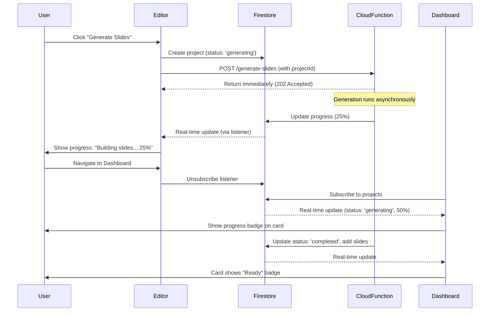

# Background Generation with Firestore Status Tracking

## Purpose

This feature enables **background slide deck generation** with real-time progress tracking. Users can:

- Navigate away from the generation page without losing progress
- Close their browser and return later to find completed projects
- Work on other projects while generation completes
- See live progress indicators in both the Editor and Dashboard

The generation process now runs entirely server-side in Firebase Cloud Functions, with status updates written directly to Firestore. The frontend uses real-time listeners to display progress anywhere in the application.

## Architecture Overview




## Data Model Changes

### 1. Update ProjectData Interface

**File:** `src/services/projectService.ts`Add new optional fields to `ProjectData` interface (lines 102-117):

```typescript
export interface ProjectData {
    // ... existing fields ...
    status?: 'generating' | 'completed' | 'failed';  // NEW
    generationProgress?: number;  // NEW: 0-100
    generationError?: string;  // NEW: Error message if failed
    generationStartedAt?: Timestamp;  // NEW: When generation started
    generationCompletedAt?: Timestamp;  // NEW: When generation finished
}
```

**Backward Compatibility:** All new fields are optional, so existing projects without these fields will default to `status: 'completed'` (assumed already generated).

### 2. Update Firestore Security Rules

**File:** `firestore.rules`Update `isValidProject()` function (line 15-21) to allow new status fields:

```javascript
function isValidProject() {
   let data = request.resource.data;
   // DENY forbidden legacy fields and root slides array
   return !data.keys().hasAny(['slides', 'imagePrompt', 'prompts', 'legacy'])
       // REQUIRE essential metadata fields
       && data.keys().hasAll(['title', 'updatedAt', 'userId'])
       // ALLOW new status fields (optional, so no validation needed)
       && (!data.keys().hasAny(['status']) || data.status in ['generating', 'completed', 'failed'])
       && (!data.keys().hasAny(['generationProgress']) || (data.generationProgress is int && data.generationProgress >= 0 && data.generationProgress <= 100));
}
```


## Backend Changes (Cloud Functions)

### 3. Modify Cloud Function Endpoint

**File:** `functions/src/index.ts`Change the `/generate-slides` endpoint (lines 26-74) to:

1. Accept `projectId` in request body
2. Return immediately with 202 Accepted status
3. Run generation asynchronously
4. Update Firestore directly instead of returning HTTP response

**Key Changes:**

- Import `admin` Firestore instance (already imported)
- Accept `projectId` from request body
- Return 202 immediately after validation
- Call generation function asynchronously (don't await)
- Update Firestore with progress and final results

**Implementation:**

```typescript
app.post('/generate-slides', verifyAuth, rateLimitMiddleware, async (req: AuthenticatedRequest, res: express.Response) => {
    try {
        const {
            projectId,  // NEW: Required
            topic,
            gradeLevel,
            subject,
            sourceMaterial,
            numSlides,
            useWebSearch,
            additionalInstructions,
            temperature,
            bulletsPerSlide,
            uploadedFileNames
        } = req.body;

        // Validation
        if (!projectId) {
            res.status(400).json({ error: "Missing required field: projectId" });
            return;
        }
        if (!topic || !gradeLevel || !subject) {
            res.status(400).json({ error: "Missing required fields: topic, gradeLevel, subject" });
            return;
        }

        const userId = req.user.uid;
        const db = admin.firestore();
        const projectRef = db.collection('users').doc(userId).collection('projects').doc(projectId);

        // Verify project exists and belongs to user
        const projectDoc = await projectRef.get();
        if (!projectDoc.exists) {
            res.status(404).json({ error: "Project not found" });
            return;
        }

        // Return 202 Accepted immediately
        res.status(202).json({ 
            message: "Generation started",
            projectId 
        });

        // Run generation asynchronously (don't await)
        generateSlidesAndUpdateFirestore(
            projectRef,
            topic,
            gradeLevel,
            subject,
            sourceMaterial || "",
            numSlides || 5,
            useWebSearch || false,
            additionalInstructions,
            temperature,
            bulletsPerSlide,
            uploadedFileNames
        ).catch(error => {
            console.error("Background generation error:", error);
            // Update project with error status
            projectRef.update({
                status: 'failed',
                generationError: error.message || "Generation failed",
                updatedAt: admin.firestore.FieldValue.serverTimestamp()
            }).catch(updateError => {
                console.error("Failed to update error status:", updateError);
            });
        });

    } catch (error: any) {
        console.error("Generate Slides Error:", error);
        // If we haven't sent response yet, send error
        if (!res.headersSent) {
            res.status(500).json({ error: "Internal Server Error" });
        }
    }
});
```


### 4. Create Async Generation Function

**File:** `functions/src/services/slideGeneration.ts`Add new function `generateSlidesAndUpdateFirestore` that:

1. Updates progress at key milestones
2. Writes slides to Firestore subcollection
3. Updates project status to 'completed' or 'failed'

**Implementation (add after existing `generateSlides` function):**

```typescript
import * as admin from 'firebase-admin';

export async function generateSlidesAndUpdateFirestore(
    projectRef: admin.firestore.DocumentReference,
    topic: string,
    gradeLevel: string,
    subject: string,
    sourceMaterial: string,
    numSlides: number,
    useWebSearch: boolean,
    additionalInstructions?: string,
    temperature?: number,
    bulletsPerSlide?: number,
    uploadedFileNames?: string[]
): Promise<void> {
    const db = admin.firestore();
    
    try {
        // Update: Generation started
        await projectRef.update({
            status: 'generating',
            generationProgress: 0,
            generationStartedAt: admin.firestore.FieldValue.serverTimestamp(),
            updatedAt: admin.firestore.FieldValue.serverTimestamp()
        });

        // Update: Research phase (25%)
        await projectRef.update({
            generationProgress: 25,
            updatedAt: admin.firestore.FieldValue.serverTimestamp()
        });

        // Generate slides
        const result = await generateSlides(
            topic,
            gradeLevel,
            subject,
            sourceMaterial,
            numSlides,
            useWebSearch,
            additionalInstructions,
            temperature,
            bulletsPerSlide,
            uploadedFileNames
        );

        // Update: Generation complete, writing to Firestore (75%)
        await projectRef.update({
            generationProgress: 75,
            updatedAt: admin.firestore.FieldValue.serverTimestamp()
        });

        // Write slides to subcollection
        const slidesCollectionRef = projectRef.collection('slides');
        const batch = db.batch();
        
        result.slides.forEach((slide, index) => {
            const slideId = slide.id || `slide-${Date.now()}-${index}`;
            const slideRef = slidesCollectionRef.doc(slideId);
            batch.set(slideRef, {
                ...slide,
                id: slideId,
                sortOrder: typeof slide.sortOrder === 'number' ? slide.sortOrder : index,
                updatedAt: admin.firestore.FieldValue.serverTimestamp()
            });
        });
        
        await batch.commit();

        // Update: Complete (100%)
        await projectRef.update({
            status: 'completed',
            generationProgress: 100,
            sources: result.sources || [],
            inputTokens: result.inputTokens,
            outputTokens: result.outputTokens,
            generationCompletedAt: admin.firestore.FieldValue.serverTimestamp(),
            updatedAt: admin.firestore.FieldValue.serverTimestamp()
        });

    } catch (error: any) {
        console.error("Generation error:", error);
        await projectRef.update({
            status: 'failed',
            generationError: error.message || "Generation failed",
            updatedAt: admin.firestore.FieldValue.serverTimestamp()
        });
        throw error; // Re-throw for caller to handle
    }
}
```

**Note:** Progress milestones (25%, 75%, 100%) are estimates. Actual generation time varies, but these provide user feedback.

## Frontend Changes

### 5. Update Editor Component - Create Project First

**File:** `src/components/Editor.tsx`Modify `handleGenerateSlides` (lines 117-219) to:

1. Create project immediately with `status: 'generating'`
2. Navigate to project page immediately
3. Call Cloud Function with `projectId`
4. Set up Firestore listener for status updates
5. Handle real-time progress updates

**Key Changes:**

- Move project creation BEFORE generation call
- Create project with empty slides array and `status: 'generating'`
- Navigate immediately after project creation
- Set up `onSnapshot` listener for project status
- Update local state from Firestore updates
- Clean up listener on unmount

**Implementation:**

```typescript
const handleGenerateSlides = useCallback(async () => {
    if (!topic || !gradeLevel || !subject) {
        setError("Please provide a topic, grade level, and subject for your presentation.");
        return;
    }
    setIsLoading(true);
    setError(null);
    setSlides(null);

    try {
        const sourceMaterial = uploadedFiles.map(f => `File: ${f.name}\n---\n${f.content}\n---`).join('\n\n');
        const uploadedFileNames = uploadedFiles.map(f => f.name);

        if (user) {
            // 1. Create project IMMEDIATELY with generating status
            const newProjectId = await createProject(user.uid, {
                title: topic,
                topic,
                gradeLevel,
                subject,
                additionalInstructions,
                slides: [], // Empty initially
                sources: [],
                status: 'generating', // NEW
                generationProgress: 0, // NEW
                generationStartedAt: serverTimestamp() // NEW (handled by createProject)
            });

            setCurrentProjectId(newProjectId);

            // 2. Upload files first (if any)
            const uploadedProjectFiles: ProjectFile[] = [];
            for (const fileData of uploadedFiles) {
                if (fileData.storagePath && fileData.downloadUrl) {
                    uploadedProjectFiles.push({
                        id: crypto.randomUUID(),
                        name: fileData.name,
                        storagePath: fileData.storagePath,
                        downloadUrl: fileData.downloadUrl,
                        mimeType: 'application/octet-stream',
                        size: fileData.size,
                        extractedContent: fileData.content
                    });
                } else if (fileData.file) {
                    const projectFile = await uploadFileToStorage(user.uid, newProjectId, fileData.file);
                    projectFile.extractedContent = fileData.content;
                    uploadedProjectFiles.push(projectFile);
                }
            }

            if (uploadedProjectFiles.length > 0) {
                await updateProject(user.uid, newProjectId, { files: uploadedProjectFiles });
            }

            // 3. Navigate to project page immediately
            navigate(`/project/${newProjectId}`, { replace: true });

            // 4. Start generation (fire and forget - updates Firestore directly)
            try {
                await generateSlidesFromDocument(
                    topic,
                    gradeLevel,
                    subject,
                    sourceMaterial,
                    numSlides,
                    useWebSearch,
                    creativityLevel,
                    bulletsPerSlide,
                    additionalInstructions,
                    uploadedFileNames,
                    newProjectId // NEW: Pass projectId
                );
            } catch (genError) {
                console.error("Generation error:", genError);
                // Error will be handled by Firestore status update
            }

            // 5. Set up Firestore listener for real-time updates
            // (See next section for listener implementation)
        }
    } catch (e) {
        console.error(e);
        setError("Failed to start generation. Please try again.");
        setIsLoading(false);
    }
}, [/* dependencies */]);
```


### 6. Add Firestore Listener in Editor

**File:** `src/components/Editor.tsx`Add `useEffect` hook to listen for project status changes when `projectId` exists:

```typescript
// Add import
import { doc, onSnapshot } from 'firebase/firestore';
import { db } from '../firebaseConfig';

// Add inside Editor component, after existing useEffects
useEffect(() => {
    if (!projectId || !user) return;

    const projectRef = doc(db, 'users', user.uid, 'projects', projectId);
    const unsubscribe = onSnapshot(projectRef, (snapshot) => {
        if (!snapshot.exists()) return;

        const projectData = snapshot.data() as ProjectData;
        
        // Update loading state based on status
        if (projectData.status === 'generating') {
            setIsLoading(true);
            // Progress will be shown in SlideDeck component
        } else if (projectData.status === 'completed') {
            setIsLoading(false);
            // Reload project to get slides
            getProject(user.uid, projectId).then(project => {
                if (project) {
                    setSlides(project.slides);
                    setSources(project.sources || []);
                }
            });
        } else if (projectData.status === 'failed') {
            setIsLoading(false);
            setError(projectData.generationError || "Generation failed. Please try again.");
        }
    }, (error) => {
        console.error("Firestore listener error:", error);
    });

    return () => unsubscribe();
}, [projectId, user]);
```


### 7. Update Gemini Service to Accept projectId

**File:** `src/services/geminiService.ts`Modify `generateSlidesFromDocument` (lines 62-106) to:

1. Accept `projectId` as optional parameter
2. Include `projectId` in request body
3. Handle 202 Accepted response (generation started)

**Changes:**

```typescript
export const generateSlidesFromDocument = async (
  topic: string,
  gradeLevel: string,
  subject: string,
  sourceMaterial: string,
  numSlides: number,
  useWebSearch: boolean = false,
  temperature: number = 0.7,
  bulletsPerSlide: number = 4,
  additionalInstructions: string = '',
  uploadedFileNames?: string[],
  projectId?: string  // NEW: Optional projectId
): Promise<{
  slides: Slide[],
  inputTokens: number,
  outputTokens: number,
  sources: string[],
  searchEntryPoint?: string,
  webSearchQueries?: string[],
  warnings: string[]
}> => {

  const result = await authenticatedRequest<any>('/generate-slides', {
    topic,
    gradeLevel,
    subject,
    sourceMaterial,
    numSlides,
    useWebSearch,
    additionalInstructions,
    temperature,
    bulletsPerSlide,
    uploadedFileNames,
    projectId  // NEW: Include in request
  });

  // If projectId provided, function returns 202 and updates Firestore directly
  // Return empty result (slides will come from Firestore listener)
  if (projectId) {
    return {
      slides: [],
      inputTokens: 0,
      outputTokens: 0,
      sources: [],
      warnings: []
    };
  }

  // Legacy behavior: return result directly (for backward compatibility)
  return {
    slides: result.slides,
    inputTokens: result.inputTokens,
    outputTokens: result.outputTokens,
    sources: result.sources || [],
    searchEntryPoint: result.searchEntryPoint,
    webSearchQueries: result.webSearchQueries,
    warnings: result.warnings || []
  };
};
```


### 8. Update SlideDeck Component - Show Progress

**File:** `src/components/SlideDeck.tsx`Modify `Loader` component (lines 37-55) to accept and display progress percentage:**Changes:**

```typescript
interface SlideDeckProps {
    // ... existing props ...
    generationProgress?: number;  // NEW: Optional progress (0-100)
}

const Loader: React.FC<{ progress?: number }> = ({ progress }) => (
    <div className="flex flex-col items-center justify-center h-[60vh] text-center px-4">
        <div className="w-full max-w-xs mb-10">
            {/* Progress Bar with actual progress */}
            <div className="h-1.5 w-full bg-slate-100 rounded-full overflow-hidden relative">
                <div 
                    className="absolute top-0 bottom-0 left-0 bg-primary rounded-full transition-all duration-300"
                    style={{ width: `${progress || 33}%` }}
                ></div>
            </div>
            <div className="flex justify-between mt-2">
                <div className="w-2 h-2 rounded-full bg-primary/20 animate-pulse"></div>
                <div className="w-2 h-2 rounded-full bg-primary/40 animate-pulse delay-75"></div>
                <div className="w-2 h-2 rounded-full bg-primary/20 animate-pulse delay-150"></div>
            </div>
            {progress !== undefined && (
                <p className="text-sm text-secondary-text mt-2">{progress}%</p>
            )}
        </div>
        <h2 className="text-3xl font-bold text-primary-text mb-3 tracking-tight">Building slides</h2>
        <p className="text-secondary-text text-lg font-medium max-w-md mx-auto leading-relaxed">
            researching, organizing and writing your content
        </p>
        {/* NEW: Add "Go to Dashboard" button */}
        <button
            onClick={() => window.location.href = '/'}
            className="mt-6 px-4 py-2 text-sm text-primary hover:text-primary/80 font-semibold border border-primary/30 rounded-lg hover:border-primary/50 transition-colors"
        >
            Go to Dashboard
        </button>
    </div>
);

// Update usage in component
if (isLoading) {
    return <Loader progress={generationProgress} />;
}
```


### 9. Update Editor to Pass Progress to SlideDeck

**File:** `src/components/Editor.tsx`Add state for `generationProgress` and pass to `SlideDeck`:

```typescript
const [generationProgress, setGenerationProgress] = useState<number | undefined>(undefined);

// Update Firestore listener to capture progress
useEffect(() => {
    // ... existing listener code ...
    const unsubscribe = onSnapshot(projectRef, (snapshot) => {
        // ... existing code ...
        if (projectData.status === 'generating') {
            setIsLoading(true);
            setGenerationProgress(projectData.generationProgress); // NEW
        }
        // ... rest of handler
    });
    // ...
}, [projectId, user]);

// Pass to SlideDeck
<SlideDeck
    slides={slides}
    sources={sources}
    isLoading={isLoading}
    error={error}
    onUpdateSlide={handleUpdateSlide}
    creativityLevel={creativityLevel}
    userId={user.uid}
    projectId={currentProjectId}
    generationProgress={generationProgress}  // NEW
/>
```


### 10. Update Dashboard - Real-time Project Status

**File:** `src/components/Dashboard.tsx`Replace static `getUserProjects` fetch with real-time listener:**Changes:**

1. Use `onSnapshot` instead of `getDocs`
2. Show progress badge on generating projects
3. Auto-update when status changes

**Implementation:**

```typescript
import { collection, query, orderBy, onSnapshot } from 'firebase/firestore';
import { db } from '../firebaseConfig';

// Replace useEffect (lines 17-24) with:
useEffect(() => {
    if (!user?.uid) return;

    const projectsRef = collection(db, 'users', user.uid, 'projects');
    const q = query(projectsRef, orderBy('updatedAt', 'desc'));
    
    const unsubscribe = onSnapshot(q, async (snapshot) => {
        const projectsData = await Promise.all(
            snapshot.docs.map(async (doc) => {
                const projectData = {
                    id: doc.id,
                    ...doc.data()
                } as ProjectData;

                // Fetch slides count from subcollection
                const slidesRef = collection(doc.ref, 'slides');
                const slidesSnapshot = await getDocs(slidesRef);
                const slides = slidesSnapshot.docs.map(slideDoc => slideDoc.data() as Slide);

                return {
                    ...projectData,
                    slides
                };
            })
        );

        setProjects(projectsData);
        setIsLoading(false);
    }, (error) => {
        console.error("Error listening to projects:", error);
        setIsLoading(false);
    });

    return () => unsubscribe();
}, [user.uid]);
```


### 11. Add Progress Badge to Dashboard Cards

**File:** `src/components/Dashboard.tsx`Update project card rendering (lines 140-186) to show status badge:

```typescript
{projects.map((project) => (
    <div
        key={project.id}
        onClick={() => navigate(`/project/${project.id}`)}
        className="group/card rounded-xl pt-5 pb-4 px-6 cursor-pointer border border-[rgba(0,0,0,0.06)] shadow-[0_1px_3px_rgba(0,0,0,0.08)] bg-surface hover:shadow-[0_4px_12px_rgba(0,0,0,0.12)] hover:-translate-y-0.5 transition-all duration-150 ease-out relative flex flex-col min-h-[140px]"
    >
        {/* Status Badge - NEW */}
        {project.status === 'generating' && (
            <div className="absolute top-3 left-3 bg-primary/10 text-primary px-2 py-1 rounded-md text-xs font-semibold flex items-center gap-1">
                <svg className="animate-spin h-3 w-3" xmlns="http://www.w3.org/2000/svg" fill="none" viewBox="0 0 24 24">
                    <circle className="opacity-25" cx="12" cy="12" r="10" stroke="currentColor" strokeWidth="4"></circle>
                    <path className="opacity-75" fill="currentColor" d="M4 12a8 8 0 018-8V0C5.373 0 0 5.373 0 12h4zm2 5.291A7.962 7.962 0 014 12H0c0 3.042 1.135 5.824 3 7.938l3-2.647z"></path>
                </svg>
                Generating{project.generationProgress !== undefined ? ` ${project.generationProgress}%` : ''}
            </div>
        )}
        {project.status === 'failed' && (
            <div className="absolute top-3 left-3 bg-red-100 text-red-600 px-2 py-1 rounded-md text-xs font-semibold">
                Failed
            </div>
        )}

        {/* ... rest of card content ... */}
    </div>
))}
```


### 12. Update ProjectService - Handle Status Fields

**File:** `src/services/projectService.ts`Update `createProject` (lines 122-166) to handle new status fields:

```typescript
export const createProject = async (userId: string, data: Omit<ProjectData, 'userId' | 'createdAt' | 'updatedAt' | 'id'>) => {
    try {
        const projectsCollectionRef = collection(db, 'users', userId, 'projects');
        const newProjectRef = doc(projectsCollectionRef);

        const { slides, ...projectMetadata } = data;

        const projectData = {
            ...projectMetadata,
            userId,
            createdAt: serverTimestamp(),
            updatedAt: serverTimestamp(),
        };

        await setDoc(newProjectRef, projectData);

        // Only write slides if they exist (not empty array for generating projects)
        if (slides && slides.length > 0) {
            const slidesCollectionRef = collection(newProjectRef, 'slides');
            await Promise.all(slides.map(async (slide, index) => {
                const slideId = slide.id || crypto.randomUUID();
                const slideDocRef = doc(slidesCollectionRef, slideId);
                const slideData = {
                    ...slide,
                    id: slideId,
                    sortOrder: typeof slide.sortOrder === 'number' ? slide.sortOrder : index
                };
                await setDoc(slideDocRef, slideData);
            }));
        }

        console.log(`Project created with ID: ${newProjectRef.id}`);
        return newProjectRef.id;
    } catch (error) {
        console.error("Error creating project:", error);
        throw error;
    }
};
```


## Edge Cases & Error Handling

### 13. Handle Function Timeout

**File:** `functions/src/index.ts`Cloud Functions have a 300-second (5-minute) timeout. For longer generations:

- Current timeout is already set to 300s (line 128)
- If generation exceeds timeout, function will fail
- Error handler will update project status to 'failed'
- User can retry generation

**Future Enhancement:** Consider using Cloud Tasks for longer-running jobs (out of scope for this plan).

### 14. Handle Network Failures

**File:** `src/components/Editor.tsx`If Cloud Function call fails before 202 response:

- Show error message
- Project remains in 'generating' state
- User can manually retry or delete project

**Implementation:** Add error handling in `handleGenerateSlides`:

```typescript
try {
    await generateSlidesFromDocument(/* ... */);
} catch (genError) {
    // If project was created but generation failed to start
    if (newProjectId) {
        await updateProject(user.uid, newProjectId, {
            status: 'failed',
            generationError: "Failed to start generation. Please try again."
        });
    }
    setError("Failed to start generation. Please try again.");
    setIsLoading(false);
}
```


### 15. Handle Stale Generating Status

**File:** `functions/src/services/slideGeneration.ts`If a project is stuck in 'generating' state (e.g., function crashed):

- Add a cleanup function (future enhancement)
- For now, users can manually delete stuck projects
- Consider adding a "Retry" button in UI (future enhancement)

### 16. Backward Compatibility

**All Files:**

- Existing projects without `status` field are treated as `'completed'`
- Dashboard checks: `project.status || 'completed'`
- Editor checks: `project.status !== 'generating'` (undefined = not generating)

**Implementation in Dashboard:**

```typescript
const status = project.status || 'completed';
if (status === 'generating') {
    // Show progress badge
}
```


## Testing Considerations

1. **Test Generation Flow:**

- Create new project → verify status is 'generating'
- Navigate away → verify generation continues
- Return to dashboard → verify progress badge shows
- Wait for completion → verify status updates to 'completed'

2. **Test Error Handling:**

- Simulate function failure → verify status updates to 'failed'
- Test network failure during generation start
- Test browser close/reopen scenario

3. **Test Backward Compatibility:**

- Load existing project without status field → verify it works
- Verify old projects display correctly in dashboard

## Migration Notes

- No database migration required (all fields optional)
- Existing projects continue to work
- New projects automatically use status tracking
- No breaking changes to existing APIs (projectId is optional in geminiService)

## Summary of File Changes

1. `src/services/projectService.ts` - Add status fields to interface, update createProject
2. `firestore.rules` - Allow status fields in validation
3. `functions/src/index.ts` - Modify endpoint to return 202, run async
4. `functions/src/services/slideGeneration.ts` - Add generateSlidesAndUpdateFirestore function
5. `src/components/Editor.tsx` - Create project first, add Firestore listener, pass progress
6. `src/services/geminiService.ts` - Accept projectId parameter