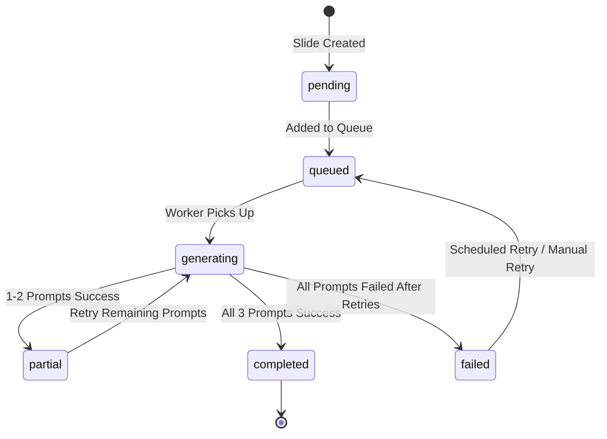

# Harden Image Prompt Generation System

## Root Cause Analysis (First Principles)

### Primary Failure Modes

1. **Circuit Breaker Opens Prematurely**

- Location: `shared/utils/retryLogic.ts:49-52`
- Process-local circuit breaker opens after 5 failures in 60 seconds
- Once open, ALL subsequent requests fail immediately with `CIRCUIT_OPEN` error
- This error is marked `isRetryable=false` → permanent failure
- When 20 slides trigger simultaneously, failures cascade across instances
- Result: 15/20 slides fail permanently even though rate limit (1000/min) is not exceeded

2. **Process-Local Rate Limiter Cannot Coordinate**

- Location: `shared/utils/retryLogic.ts:11-32`
- Each Cloud Function instance has its own `RateLimiter` singleton
- Multiple triggers in same instance compete for 5 concurrent slots
- No queuing mechanism - requests just fail and retry
- Multiple instances execute in parallel with no global coordination

3. **Uncoordinated Parallel Execution**

- All 20 slides written via `batch.commit()` → all triggers fire simultaneously
- Cloud Functions spawns multiple instances (5-10 instances)
- Each instance processes multiple slides concurrently (Node.js event loop)
- No pacing/queuing mechanism to prevent flood

4. **Silent Failures**

- Location: `functions/src/index.ts:314-316`
- Errors caught but slide state never updated
- No retry mechanism for permanent failures
- UI shows infinite spinner because `imagePrompts.length === 0` forever

5. **All-or-Nothing Result Handling**

- Location: `functions/src/index.ts:292`
- If `result.prompts.length === 0`, nothing is saved
- Partial successes (1-2 prompts) are discarded
- No incremental progress tracking

### Why 15/20 Failed Specifically

With 1000 requests/minute limit, the issue is NOT API rate limiting but:

- Circuit breaker opens after 5 failures in one instance
- Multiple instances execute in parallel, each with its own breaker
- Some instances hit threshold faster (transient errors, timeouts)
- Circuit breaker opens → all remaining slides in those instances fail with `CIRCUIT_OPEN`
- This error is non-retryable → permanent failure
- Result: ~3 instances × ~5 slides each = ~15 slides fail permanently

## Solution Architecture

### Core Principles

1. **State Machine Pattern**: Explicit state tracking in Firestore
2. **Idempotent Operations**: Safe to retry any number of times
3. **Partial Success Handling**: Save progress incrementally
4. **Disable Circuit Breaker for Prompt Generation**: Rate limit not the constraint
5. **Firestore-Based Queue**: Use Firestore as persistent queue for coordination
6. **Paced Execution**: Process slides in controlled batches
7. **Observable State**: UI can display accurate status

### State Machine Design



**States:**

- `pending`: Slide created, not yet queued
- `queued`: Added to processing queue, waiting for worker
- `generating`: Actively generating prompts
- `partial`: Some prompts succeeded (1-2), retrying for remainder
- `failed`: All attempts exhausted, manual intervention needed
- `completed`: All 3 prompts generated successfully

## Implementation Plan

### Phase 0: Disable Circuit Breaker for Prompt Generation

#### 0.1 Create Prompt-Specific Retry Function

**File:** `shared/utils/retryLogic.ts` (add new function)Create a variant of `retryWithBackoff` that disables circuit breaker for prompt generation:

```typescript
/**
    * Retry function specifically for prompt generation.
    * Disables circuit breaker since we have high rate limits (1000/min)
    * and failures are usually transient network issues.
 */
export async function retryPromptGeneration<T>(
    fn: () => Promise<T>, 
    retries = MAX_RETRIES, 
    delay = INITIAL_DELAY_MS, 
    deadline?: number
): Promise<T> {
    if (!deadline) {
        deadline = Date.now() + TIMEOUT_MS;
    }

    const now = Date.now();
    if (now > deadline) {
        throw new GeminiError(`Request timed out after ${TIMEOUT_MS}ms`, 'TIMEOUT', false);
    }

    // Use rate limiter for concurrency control but NOT circuit breaker
    await rateLimiter.acquire();

    let timeoutId: any = null;

    try {
        const timeRemaining = deadline - now;
        if (timeRemaining < 250) {
            throw new GeminiError('Global deadline exceeded', 'TIMEOUT', false);
        }

        const attemptTimeout = timeRemaining;
        const timeoutPromise = new Promise<never>((_, reject) => {
            timeoutId = setTimeout(() => reject(new GeminiError('Request timed out', 'TIMEOUT', true)), attemptTimeout);
        });

        const result = await Promise.race([fn(), timeoutPromise]);
        if (timeoutId) clearTimeout(timeoutId);

        rateLimiter.release();
        return result;

    } catch (error: any) {
        if (timeoutId) clearTimeout(timeoutId);

        const errorMessage = (error?.message || '').toLowerCase();
        
        // Non-retryable errors
        if (errorMessage.includes('context length') || errorMessage.includes('token limit') || 
            errorMessage.includes('payload too large') || error.status === 400) {
            rateLimiter.release();
            if (error instanceof GeminiError) throw error;
            throw new GeminiError(error.message, 'INVALID_REQUEST', false, error);
        }

        // Determine if retryable
        const status = error?.status || error?.response?.status;
        const isRetryable =
            (error instanceof GeminiError && error.isRetryable) ||
            status === 429 || status === 503 || status === 500 || 
            status === 502 || status === 504 || status === 408 ||
            errorMessage.includes('429') || errorMessage.includes('503') ||
            errorMessage.includes('network') || errorMessage.includes('timeout') ||
            errorMessage.includes('econnreset');

        // DO NOT use circuit breaker - just release and retry
        rateLimiter.release();

        if (!isRetryable || retries <= 0) {
            if (error instanceof GeminiError) throw error;
            throw new GeminiError(error.message, 'API_ERROR', false, error);
        }

        // Exponential backoff with jitter
        let nextDelay: number;
        if (error?.retryDelay) {
            nextDelay = error.retryDelay + (Math.random() * 200);
        } else {
            nextDelay = Math.min(delay * 2, MAX_DELAY_MS) + (Math.random() * 200);
        }

        const timeNow = Date.now();
        const timeLeft = deadline - timeNow;

        if (timeLeft < 500) {
            throw new GeminiError("Deadline exceeded", 'TIMEOUT', false);
        }

        if (nextDelay > (timeLeft - 500)) {
            nextDelay = timeLeft - 500;
        }

        console.warn(`Retrying prompt generation... Attempts left: ${retries}. Delay: ${Math.round(nextDelay)}ms`);
        await new Promise(resolve => setTimeout(resolve, nextDelay));

        return retryPromptGeneration(fn, retries - 1, nextDelay, deadline);
    }
}
```


#### 0.2 Update `generateImagePrompts` to Use New Retry Function

**File:** `functions/src/services/imageGeneration.ts`Replace `retryWithBackoff` with `retryPromptGeneration`:

```typescript
import { retryPromptGeneration } from '@shared/utils/retryLogic';

// In generateImagePrompts function, line 140:
try {
    const promptResult = await retryPromptGeneration(generateFn); // Changed from retryWithBackoff
    prompts.push(promptResult);
    // ... rest of code
}
```


### Phase 1: State Machine Infrastructure

#### 1.1 Update Type Definitions

**File:** `shared/types.ts`Add state machine fields to `Slide` interface:

```typescript
export interface Slide {
    // ... existing fields ...
    
    // State machine fields
    promptGenerationState?: 'pending' | 'queued' | 'generating' | 'partial' | 'completed' | 'failed';
    promptGenerationError?: string;
    promptGenerationAttempts?: number;
    promptGenerationLastAttempt?: any; // Firestore Timestamp
    promptGenerationNextRetry?: any; // Firestore Timestamp (for exponential backoff)
    promptGenerationQueuedAt?: any; // Firestore Timestamp (when added to queue)
    
    // Partial progress tracking
    promptGenerationProgress?: {
        succeeded: number; // Count of prompts successfully generated
        failed: number;    // Count of prompts that failed after retries
        lastSuccessAt?: any;
    };
}
```


#### 1.2 Create State Machine Service

**File:** `functions/src/services/promptGenerationStateMachine.ts` (new)Create service to manage state transitions with validation:

```typescript
export type PromptGenerationState = 'pending' | 'queued' | 'generating' | 'partial' | 'completed' | 'failed';

export function validateStateTransition(
    currentState: PromptGenerationState | undefined,
    newState: PromptGenerationState
): boolean {
    const validTransitions: Record<PromptGenerationState, PromptGenerationState[]> = {
        'pending': ['queued', 'generating', 'failed'],
        'queued': ['generating', 'failed'],
        'generating': ['partial', 'completed', 'failed'],
        'partial': ['generating', 'completed', 'failed'],
        'failed': ['queued', 'generating'],
        'completed': []
    };
    
    if (!currentState) {
        return newState === 'pending' || newState === 'queued' || newState === 'generating';
    }
    
    return validTransitions[currentState]?.includes(newState) ?? false;
}

export function calculateNextRetryTime(attempts: number): Date {
    // Exponential backoff: 2^attempts minutes, capped at 60 minutes
    const minutes = Math.min(Math.pow(2, attempts), 60);
    return new Date(Date.now() + minutes * 60 * 1000);
}
```


#### 1.3 Update Firestore Security Rules

**File:** `firestore.rules`Add validation for new state fields in `isValidSlide()` function:

```javascript
function isValidSlide() {
    let data = request.resource.data;
    return !data.keys().hasAny(['imagePrompt', 'prompts'])
        && data.keys().hasAll(['id', 'title', 'content', 'sortOrder'])
        && (!data.keys().hasAny(['promptGenerationState']) || 
            data.promptGenerationState in ['pending', 'queued', 'generating', 'partial', 'completed', 'failed'])
        && (!data.keys().hasAny(['promptGenerationAttempts']) || 
            data.promptGenerationAttempts is int && data.promptGenerationAttempts >= 0);
}
```


### Phase 2: Firestore-Based Queue System

#### 2.1 Create Queue Management Service

**File:** `functions/src/services/promptQueue.ts` (new)Create a Firestore-based queue for coordinating prompt generation:

```typescript
import * as admin from 'firebase-admin';
import { FieldValue } from 'firebase-admin/firestore';

const QUEUE_COLLECTION = 'promptGenerationQueue';
const BATCH_SIZE = 10; // Process 10 slides at a time
const QUEUE_PROCESSING_INTERVAL_MS = 5000; // Check queue every 5 seconds

export interface QueueItem {
    slideId: string;
    projectId: string;
    userId: string;
    slideRef: admin.firestore.DocumentReference;
    projectRef: admin.firestore.DocumentReference;
    priority: number; // Lower = higher priority (0 = highest)
    queuedAt: admin.firestore.Timestamp;
    attempts: number;
}

/**
    * Add slide to processing queue
 */
export async function enqueueSlide(
    slideRef: admin.firestore.DocumentReference,
    projectRef: admin.firestore.DocumentReference,
    userId: string,
    projectId: string
): Promise<void> {
    const db = admin.firestore();
    const queueRef = db.collection(QUEUE_COLLECTION).doc(slideRef.id);
    
    await queueRef.set({
        slideId: slideRef.id,
        projectId,
        userId,
        slidePath: slideRef.path,
        projectPath: projectRef.path,
        priority: 0, // All slides get same priority initially
        queuedAt: FieldValue.serverTimestamp(),
        attempts: 0,
        status: 'queued',
        processedAt: null
    }, { merge: true });
}

/**
    * Process next batch of items from queue
 */
export async function processQueueBatch(
    processFn: (item: QueueItem) => Promise<void>
): Promise<number> {
    const db = admin.firestore();
    const queueRef = db.collection(QUEUE_COLLECTION);
    
    // Get next batch of queued items, ordered by priority then queuedAt
    const snapshot = await queueRef
        .where('status', '==', 'queued')
        .orderBy('priority')
        .orderBy('queuedAt')
        .limit(BATCH_SIZE)
        .get();

    if (snapshot.empty) {
        return 0;
    }

    let processed = 0;
    
    // Process items in parallel (but rate limiter controls actual API concurrency)
    await Promise.allSettled(snapshot.docs.map(async (doc) => {
        const data = doc.data();
        
        // Mark as processing atomically
        const updateResult = await db.runTransaction(async (transaction) => {
            const currentDoc = await transaction.get(doc.ref);
            const currentData = currentDoc.data();
            
            if (currentData?.status !== 'queued') {
                return null; // Already being processed
            }
            
            transaction.update(doc.ref, {
                status: 'processing',
                processedAt: FieldValue.serverTimestamp()
            });
            
            return {
                slideRef: db.doc(data.slidePath),
                projectRef: db.doc(data.projectPath),
                slideId: data.slideId,
                projectId: data.projectId,
                userId: data.userId,
                attempts: data.attempts || 0
            };
        });

        if (!updateResult) {
            return; // Another worker picked it up
        }

        try {
            await processFn({
                slideId: updateResult.slideId,
                projectId: updateResult.projectId,
                userId: updateResult.userId,
                slideRef: updateResult.slideRef,
                projectRef: updateResult.projectRef,
                priority: 0,
                queuedAt: admin.firestore.Timestamp.now(),
                attempts: updateResult.attempts
            });
            
            // Mark as complete
            await doc.ref.delete(); // Remove from queue
            
            processed++;
        } catch (error) {
            console.error(`Error processing queue item ${doc.id}:`, error);
            
            // Increment attempts and re-queue or mark as failed
            const attempts = (data.attempts || 0) + 1;
            if (attempts < 5) {
                await doc.ref.update({
                    status: 'queued',
                    attempts,
                    priority: attempts, // Lower priority for retries
                    processedAt: null
                });
            } else {
                await doc.ref.update({
                    status: 'failed',
                    error: error instanceof Error ? error.message : 'Unknown error'
                });
            }
        }
    }));

    return processed;
}
```


#### 2.2 Create Scheduled Queue Processor

**File:** `functions/src/index.ts`Add scheduled function to process queue:

```typescript
import { onSchedule } from 'firebase-functions/v2/scheduler';
import { processQueueBatch } from './services/promptQueue';
import { generateImagePromptsForSlide } from './services/promptGenerationService';

export const processPromptGenerationQueue = onSchedule(
    {
        schedule: 'every 5 seconds',
        timeZone: 'UTC',
        secrets: [apiKey],
        maxInstances: 1 // Only one worker processing queue at a time
    },
    async (event) => {
        console.log('Processing prompt generation queue...');
        
        let totalProcessed = 0;
        let batchCount = 0;
        const maxBatches = 10; // Process up to 10 batches per run (100 slides max)
        
        // Process multiple batches in this run
        while (batchCount < maxBatches) {
            const processed = await processQueueBatch(async (item) => {
                await generateImagePromptsForSlide(item);
            });
            
            if (processed === 0) {
                break; // Queue is empty
            }
            
            totalProcessed += processed;
            batchCount++;
            
            // Small delay between batches
            if (batchCount < maxBatches) {
                await new Promise(resolve => setTimeout(resolve, 1000));
            }
        }
        
        console.log(`Processed ${totalProcessed} items from queue`);
    }
);
```


### Phase 3: Refactor Trigger to Use Queue

#### 3.1 Update `onSlideCreated` Trigger

**File:** `functions/src/index.ts`Refactor trigger to enqueue instead of processing directly:

```typescript
export const onSlideCreated = onDocumentCreated(
    {
        document: 'users/{userId}/projects/{projectId}/slides/{slideId}',
        secrets: [apiKey],
        timeoutSeconds: 60, // Shorter timeout since we just enqueue
        maxInstances: 100 // Can handle many concurrent enqueue operations
    },
    async (event) => {
        const slideData = event.data?.data();
        const slideRef = event.data?.ref;
        if (!slideRef) return;

        const projectId = event.params.projectId;
        const userId = event.params.userId;

        // Idempotency check
        const existingPrompts = slideData?.imagePrompts || [];
        if (existingPrompts.length >= 3) {
            if (slideData?.promptGenerationState !== 'completed') {
                await slideRef.update({
                    promptGenerationState: 'completed',
                    updatedAt: admin.firestore.FieldValue.serverTimestamp()
                });
            }
            return;
        }

        const db = admin.firestore();
        const projectRef = db.collection('users').doc(userId).collection('projects').doc(projectId);

        // Initialize state and enqueue
        try {
            await db.runTransaction(async (transaction) => {
                const currentDoc = await transaction.get(slideRef);
                const currentData = currentDoc.data();
                
                // Only proceed if in pending state or no state
                const currentState = currentData?.promptGenerationState;
                if (currentState && currentState !== 'pending') {
                    return; // Already processed or queued
                }

                transaction.update(slideRef, {
                    promptGenerationState: 'pending',
                    'promptGenerationProgress.succeeded': existingPrompts.length,
                    'promptGenerationProgress.failed': 0,
                    updatedAt: admin.firestore.FieldValue.serverTimestamp()
                });
            });

            // Enqueue for processing
            await enqueueSlide(slideRef, projectRef, userId, projectId);
            
            // Update state to queued
            await slideRef.update({
                promptGenerationState: 'queued',
                promptGenerationQueuedAt: admin.firestore.FieldValue.serverTimestamp(),
                updatedAt: admin.firestore.FieldValue.serverTimestamp()
            });

        } catch (error) {
            console.error(`Error enqueueing slide ${slideRef.id}:`, error);
            // Mark as failed if we can't even enqueue
            await slideRef.update({
                promptGenerationState: 'failed',
                promptGenerationError: 'Failed to enqueue for processing',
                updatedAt: admin.firestore.FieldValue.serverTimestamp()
            });
        }
    }
);
```


### Phase 4: Idempotent Prompt Generation Service

#### 4.1 Create Prompt Generation Service

**File:** `functions/src/services/promptGenerationService.ts` (new)Create service that generates prompts with partial success handling:

```typescript
import * as admin from 'firebase-admin';
import { FieldValue } from 'firebase-admin/firestore';
import { generateImagePrompts } from './imageGeneration';
import { calculateAndIncrementProjectCost } from './pricingService';
import { MODEL_SLIDE_GENERATION } from '@shared/constants';
import { QueueItem } from './promptQueue';
import type { ImagePrompt } from '@shared/types';

export async function generateImagePromptsForSlide(item: QueueItem): Promise<void> {
    const slideRef = item.slideRef;
    const projectRef = item.projectRef;

    // Get current slide and project data
    const [slideDoc, projectDoc] = await Promise.all([
        slideRef.get(),
        projectRef.get()
    ]);

    if (!slideDoc.exists || !projectDoc.exists) {
        throw new Error('Slide or project not found');
    }

    const slideData = slideDoc.data();
    const projectData = projectDoc.data();

    // Check existing prompts
    const existingPrompts: ImagePrompt[] = slideData?.imagePrompts || [];
    
    if (existingPrompts.length >= 3) {
        // Already complete
        await slideRef.update({
            promptGenerationState: 'completed',
            updatedAt: FieldValue.serverTimestamp()
        });
        return;
    }

    // Update state to generating
    await slideRef.update({
        promptGenerationState: 'generating',
        promptGenerationAttempts: (slideData?.promptGenerationAttempts || 0) + 1,
        promptGenerationLastAttempt: FieldValue.serverTimestamp(),
        updatedAt: FieldValue.serverTimestamp()
    });

    try {
        // Generate remaining prompts
        const promptsNeeded = 3 - existingPrompts.length;
        const result = await generateImagePrompts(
            projectData?.topic || '',
            projectData?.subject || '',
            projectData?.gradeLevel || '',
            slideData?.title || '',
            slideData?.content || [],
            existingPrompts // Pass existing to avoid regenerating
        );

        // Save prompts incrementally using transactions
        for (const prompt of result.prompts) {
            await savePromptIncrementally(slideRef, prompt);
        }

        // Determine final state
        const allPrompts = [...existingPrompts, ...result.prompts];
        const finalState = allPrompts.length >= 3 ? 'completed' : 
                          result.prompts.length > 0 ? 'partial' : 'failed';

        if (finalState === 'completed') {
            // Track costs
            await calculateAndIncrementProjectCost(
                projectRef,
                MODEL_SLIDE_GENERATION,
                result.totalInputTokens,
                result.totalOutputTokens,
                'text'
            );

            await slideRef.update({
                promptGenerationState: 'completed',
                'promptGenerationProgress.succeeded': 3,
                updatedAt: FieldValue.serverTimestamp()
            });
        } else if (finalState === 'partial') {
            await slideRef.update({
                promptGenerationState: 'partial',
                'promptGenerationProgress.succeeded': allPrompts.length,
                'promptGenerationProgress.failed': result.failed || 0,
                updatedAt: FieldValue.serverTimestamp()
            });

            // Re-queue for remaining prompts
            const queueRef = admin.firestore().collection('promptGenerationQueue').doc(slideRef.id);
            await queueRef.set({
                slideId: slideRef.id,
                projectId: item.projectId,
                userId: item.userId,
                slidePath: slideRef.path,
                projectPath: projectRef.path,
                priority: (slideData?.promptGenerationAttempts || 0) + 1, // Lower priority for retries
                queuedAt: FieldValue.serverTimestamp(),
                attempts: (slideData?.promptGenerationAttempts || 0) + 1,
                status: 'queued',
                processedAt: null
            }, { merge: true });

            await slideRef.update({
                promptGenerationState: 'queued',
                promptGenerationQueuedAt: FieldValue.serverTimestamp(),
                updatedAt: FieldValue.serverTimestamp()
            });
        } else {
            // All failed
            const attempts = (slideData?.promptGenerationAttempts || 0) + 1;
            const nextRetry = calculateNextRetryTime(attempts);
            
            await slideRef.update({
                promptGenerationState: 'failed',
                promptGenerationError: `Failed to generate prompts after ${attempts} attempts`,
                promptGenerationNextRetry: admin.firestore.Timestamp.fromDate(nextRetry),
                'promptGenerationProgress.failed': result.failed || 3,
                updatedAt: FieldValue.serverTimestamp()
            });
        }

    } catch (error: any) {
        console.error(`Error generating prompts for slide ${slideRef.id}:`, error);
        
        const attempts = (slideData?.promptGenerationAttempts || 0) + 1;
        const isRetryable = error?.status === 429 || error?.status === 503 || 
                          error?.status === 500 || error?.message?.includes('timeout');
        
        if (isRetryable && attempts < 5) {
            const nextRetry = calculateNextRetryTime(attempts);
            await slideRef.update({
                promptGenerationState: 'failed',
                promptGenerationError: error?.message || 'Unknown error',
                promptGenerationNextRetry: admin.firestore.Timestamp.fromDate(nextRetry),
                promptGenerationAttempts: attempts,
                updatedAt: FieldValue.serverTimestamp()
            });

            // Re-queue for retry
            const queueRef = admin.firestore().collection('promptGenerationQueue').doc(slideRef.id);
            await queueRef.set({
                slideId: slideRef.id,
                projectId: item.projectId,
                userId: item.userId,
                slidePath: slideRef.path,
                projectPath: projectRef.path,
                priority: attempts, // Lower priority for retries
                queuedAt: FieldValue.serverTimestamp(),
                attempts,
                status: 'queued',
                processedAt: null
            }, { merge: true });
        } else {
            await slideRef.update({
                promptGenerationState: 'failed',
                promptGenerationError: error?.message || 'Unknown error',
                promptGenerationAttempts: attempts,
                updatedAt: FieldValue.serverTimestamp()
            });
        }
    }
}

async function savePromptIncrementally(
    slideRef: admin.firestore.DocumentReference,
    prompt: { id: string; text: string; inputTokens: number; outputTokens: number }
): Promise<void> {
    return slideRef.firestore.runTransaction(async (transaction) => {
        const slideDoc = await transaction.get(slideRef);
        const slideData = slideDoc.data();
        
        const existingPrompts = slideData?.imagePrompts || [];
        
        // Idempotency check
        if (existingPrompts.some((p: ImagePrompt) => p.id === prompt.id)) {
            return;
        }
        
        const updatedPrompts = [...existingPrompts, {
            id: prompt.id,
            text: prompt.text,
            createdAt: Date.now(),
            inputTokens: prompt.inputTokens,
            outputTokens: prompt.outputTokens,
            isOriginal: true
        }];
        
        transaction.update(slideRef, {
            imagePrompts: updatedPrompts,
            currentPromptId: updatedPrompts[0].id, // Set if first prompt
            'promptGenerationProgress.succeeded': updatedPrompts.length,
            'promptGenerationProgress.lastSuccessAt': FieldValue.serverTimestamp(),
            updatedAt: FieldValue.serverTimestamp()
        });
    });
}

function calculateNextRetryTime(attempts: number): Date {
    const minutes = Math.min(Math.pow(2, attempts), 60);
    return new Date(Date.now() + minutes * 60 * 1000);
}
```


#### 4.2 Update `generateImagePrompts` for Idempotency

**File:** `functions/src/services/imageGeneration.ts`Update to check existing prompts and only generate what's needed:

````typescript
export async function generateImagePrompts(
    topic: string,
    subject: string,
    gradeLevel: string,
    slideTitle: string,
    slideContent: string[],
    existingPrompts: ImagePrompt[] = [] // Pass existing to avoid regenerating
): Promise<PromptGenerationResult> {
    const systemInstructions = buildSingleSlideImagePromptSystemInstructions();
    const userPrompt = buildSingleSlideImagePromptUserPrompt(topic, subject, gradeLevel, slideTitle, slideContent);

    const prompts: Array<{ id: string; text: string; inputTokens: number; outputTokens: number }> = [];
    let totalInputTokens = 0;
    let totalOutputTokens = 0;
    let failed = 0;

    const promptsNeeded = 3 - existingPrompts.length;
    if (promptsNeeded <= 0) {
        return {
            prompts: [],
            failed: 0,
            totalInputTokens: 0,
            totalOutputTokens: 0,
            isComplete: true
        };
    }

    // Generate remaining prompts sequentially
    for (let i = 0; i < promptsNeeded; i++) {
        const generateFn = async () => {
            try {
                const result = await getAiClient().models.generateContent({
                    model: MODEL_SLIDE_GENERATION,
                    contents: [{ role: 'user', parts: [{ text: userPrompt }] }],
                    config: {
                        systemInstruction: { parts: [{ text: systemInstructions }] },
                        temperature: 0.7 + ((existingPrompts.length + i) * 0.1), // Vary temperature
                    }
                });

                const text = result.candidates?.[0]?.content?.parts?.[0]?.text;
                if (!text) {
                    throw new Error("Empty response from AI model");
                }

                let cleanedPrompt = text
                    .replace(/```[a-z]*\n?/gi, '')
                    .replace(/```/g, '')
                    .trim();
                cleanedPrompt = cleanedPrompt.replace(/^(imagePrompt|Image Prompt|Prompt):\s*/i, '').trim();

                const inputTokens = result.usageMetadata?.promptTokenCount || 0;
                const outputTokens = result.usageMetadata?.candidatesTokenCount || 0;

                return {
                    id: crypto.randomUUID(),
                    text: cleanedPrompt,
                    inputTokens,
                    outputTokens
                };
            } catch (error: any) {
                console.error(`Error in generateImagePrompts iteration ${i}:`, error);
                throw error;
            }
        };

        try {
            const promptResult = await retryPromptGeneration(generateFn);
            prompts.push(promptResult);
            totalInputTokens += promptResult.inputTokens;
            totalOutputTokens += promptResult.outputTokens;
        } catch (error) {
            console.error(`Prompt generation failed for iteration ${i}, continuing...`, error);
            failed++;
        }
    }

    return {
        prompts,
        failed,
        totalInputTokens,
        totalOutputTokens,
        isComplete: (prompts.length + existingPrompts.length) >= 3
    };
}
````


### Phase 5: Manual Retry Endpoint

#### 5.1 Create `/retry-image-prompts` Endpoint

**File:** `functions/src/index.ts`

```typescript
app.post('/retry-image-prompts', verifyAuth, async (req: AuthenticatedRequest, res: express.Response) => {
    try {
        const { slideId, projectId } = req.body;

        if (!slideId || !projectId) {
            res.status(400).json({ error: "Missing slideId or projectId" });
            return;
        }

        if (!req.user) {
            res.status(401).json({ error: "Unauthorized" });
            return;
        }

        const userId = req.user.uid;
        const db = admin.firestore();
        const projectRef = db.collection('users').doc(userId).collection('projects').doc(projectId);
        const slideRef = projectRef.collection('slides').doc(slideId);

        const slideDoc = await slideRef.get();
        if (!slideDoc.exists) {
            res.status(404).json({ error: "Slide not found" });
            return;
        }

        // Reset state and re-queue
        await slideRef.update({
            promptGenerationState: 'pending',
            promptGenerationNextRetry: admin.firestore.FieldValue.delete(),
            updatedAt: admin.firestore.FieldValue.serverTimestamp()
        });

        await enqueueSlide(slideRef, projectRef, userId, projectId);

        await slideRef.update({
            promptGenerationState: 'queued',
            promptGenerationQueuedAt: admin.firestore.FieldValue.serverTimestamp(),
            updatedAt: admin.firestore.FieldValue.serverTimestamp()
        });

        res.json({ success: true, message: "Retry initiated" });
    } catch (error: any) {
        console.error("Retry image prompts error:", error);
        res.status(500).json({ error: error.message || "Internal server error" });
    }
});
```


### Phase 6: UI Updates

#### 6.1 Update SlideCard Component

**File:** `src/components/SlideCard.tsx`Update to check `promptGenerationState` and show appropriate UI for each state.

#### 6.2 Add Frontend Service Function

**File:** `src/services/geminiService.ts`Add `retryImagePromptGeneration()` function.

### Phase 7: Initialize State on Slide Creation

#### 7.1 Update Slide Generation Service

**File:** `functions/src/services/slideGeneration.ts`Initialize `promptGenerationState: 'pending'` when creating slides.

## Key Improvements

1. **Circuit Breaker Disabled**: New `retryPromptGeneration` function doesn't use circuit breaker
2. **Queue-Based Coordination**: Firestore queue ensures paced, coordinated execution
3. **Batch Processing**: Processes 10 slides at a time, preventing flood
4. **Partial Success**: Saves prompts incrementally, doesn't lose progress
5. **State Machine**: Explicit state tracking enables proper retry logic
6. **Idempotent Operations**: Safe to retry any number of times

## Testing Strategy

1. **Load Test**: Create 50-slide deck, verify all prompts generate
2. **Failure Injection**: Simulate API failures, verify retry logic
3. **Partial Success**: Verify partial prompts are saved
4. **Queue Processing**: Verify queue processes items in order
5. **State Transitions**: Verify state machine transitions correctly

## Migration Strategy

1. All new fields optional - backward compatible