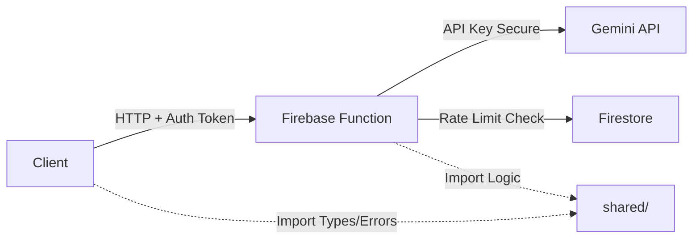

# Move Gemini API Calls to Firebase Cloud Functions

## Overview

This migration moves all Gemini API calls from the client to Firebase Cloud Functions v1, ensuring API keys remain secure on the server. The implementation uses an Express app with a single HTTP function that handles multiple routes.

## Architecture



**Current Flow**: Client → Direct Gemini API Call (API key exposed in bundle)

**New Flow**: Client → Firebase Function → Gemini API (API key secure on server)

## Key Changes

### Shared Code Directory

Create `shared/` at project root for code used by both client and server:

- `shared/errors.ts` - GeminiError (from geminiService.ts) and ImageGenError (from src/types.ts)
- `shared/constants.ts` - Model constants and defaults (merge from geminiService.ts and src/constants.ts)
- `shared/promptBuilders.ts` - All build*Section functions from geminiService.ts
- `shared/schemas.ts` - IMAGE_SPEC_SCHEMA from geminiService.ts
- `shared/utils/retryLogic.ts` - retryWithBackoff and extractFirstJsonArray from geminiService.ts
- `shared/utils/validation.ts` - validateSlideStructure from geminiService.ts

### Firebase Functions Structure

```
functions/
├── src/
│   ├── index.ts                    # Express app with all routes
│   ├── middleware/
│   │   ├── auth.ts                 # Firebase ID token verification
│   │   └── rateLimiter.ts          # Server-side rate limiting (Firestore)
│   ├── services/
│   │   ├── slideGeneration.ts      # generateSlidesFromDocument logic
│   │   ├── imageGeneration.ts      # generateImageFromSpec logic
│   │   ├── specRegeneration.ts     # regenerateImageSpec logic
│   │   └── imageTextExtraction.ts  # extractTextFromImage logic
│   └── utils/
│       └── geminiClient.ts         # Gemini client initialization (server-only)
├── package.json
├── tsconfig.json
└── .env                            # Local dev only (gitignored)
```

### Client Changes

- `src/services/geminiService.ts` - Refactored to HTTP calls only, imports errors from shared
- `src/firebaseConfig.ts` - Export functions instance
- `vite.config.ts` - Remove GEMINI_API_KEY injection
- `src/types.ts` - Remove ImageGenError class (moved to shared), keep interface types

## Implementation Steps

### Step 1: Initialize Firebase Functions

**Location**: Root directory

Run `firebase init functions`:

- Select TypeScript
- Use ESLint: Yes
- Install dependencies: Yes

This creates `functions/` directory with basic structure.

**Files Created**: `functions/`, `functions/src/index.ts`, `functions/package.json`, `functions/tsconfig.json`, `firebase.json`, `.firebaserc`

### Step 2: Install Dependencies

**Location**: `functions/package.json`

Install required packages:

```bash
cd functions
npm install @google/genai firebase-admin firebase-functions express
npm install --save-dev @types/node @types/express
```

**Files Modified**: `functions/package.json`

### Step 3: Set Up Environment Variables

**Location**: Firebase Console and `functions/.env`

1. **Firebase Console** (for production):

   - Go to Firebase Console → Functions → Configuration
   - Add config: `firebase functions:config:set gemini.api_key="YOUR_KEY"`

2. **Local Development** (`functions/.env`):
   ```env
   GEMINI_API_KEY=your_api_key_here
   ```


Add `functions/.env` to `.gitignore`

3. **Load in code** (`functions/src/utils/geminiClient.ts`):
   ```typescript
   import * as functions from 'firebase-functions';
   const GEMINI_API_KEY = functions.config().gemini?.api_key || process.env.GEMINI_API_KEY;
   ```


**Files Created**: `functions/.env` (gitignored)

**Files Modified**: `.gitignore`

### Step 4: Create Shared Code Directory

**Location**: Root directory

Create `shared/` structure and move/extract code:

1. **shared/errors.ts**:

   - Move `GeminiError` class from `src/services/geminiService.ts`
   - Move `ImageGenError` class from `src/types.ts`

2. **shared/constants.ts**:

   - Move `MODEL_SLIDE_GENERATION`, `MODEL_IMAGE_GENERATION`, `MODEL_SPEC_REGENERATION` from `geminiService.ts`
   - Copy `DEFAULT_TEMPERATURE`, `DEFAULT_BULLETS_PER_SLIDE` from `src/constants.ts`

3. **shared/promptBuilders.ts**:

   - Move all `build*Section()` functions from `geminiService.ts`
   - Move `buildSlideGenerationPrompt()` function

4. **shared/schemas.ts**:

   - Move `IMAGE_SPEC_SCHEMA` from `geminiService.ts`

5. **shared/utils/retryLogic.ts**:

   - Move `retryWithBackoff()` function
   - Move `extractFirstJsonArray()` function
   - Move constants: `MAX_RETRIES`, `INITIAL_DELAY_MS`, `MAX_DELAY_MS`, `TIMEOUT_MS`

6. **shared/utils/validation.ts**:

   - Move `validateSlideStructure()` function

7. **shared/utils/imageUtils.ts** (partial):

   - Move `formatImageSpec()` function (used by both client UI and server)
   - Move `normalizeImageSpec()` function (used by both client UI and server)
   - Move `sanitizeImageSpec()` function (used by normalizeImageSpec)
   - Move `validateImageSpec()` function (used by normalizeImageSpec)
   - Move `parseGradeLevel()` helper function
   - Move `FormatContext` interface
   - Keep UI-only functions (`getVisualIdeaSummary`, `prepareSpecForSave`) in `src/utils/imageUtils.ts`

**Files Created**:

- `shared/errors.ts`
- `shared/constants.ts`
- `shared/promptBuilders.ts`
- `shared/schemas.ts`
- `shared/utils/retryLogic.ts`
- `shared/utils/validation.ts`
- `shared/utils/imageUtils.ts` (partial - core functions only)

**Files Modified**:

- `src/services/geminiService.ts` (remove moved code, add imports)
- `src/types.ts` (remove ImageGenError class, keep interface)

### Step 5: Configure TypeScript Paths

**Location**: `functions/tsconfig.json` and root `tsconfig.json`

Update both files to support `@shared/` imports:

**functions/tsconfig.json**:

```json
{
  "compilerOptions": {
    "baseUrl": ".",
    "paths": {
      "@shared/*": ["../shared/*"]
    }
  },
  "include": ["src/**/*", "../shared/**/*"]
}
```

**tsconfig.json** (root):

```json
{
  "compilerOptions": {
    "paths": {
      "@shared/*": ["./shared/*"],
      "@/*": ["./*"]
    }
  }
}
```

**Files Modified**: `functions/tsconfig.json`, `tsconfig.json`

### Step 6: Create Gemini Client Utility

**Location**: `functions/src/utils/geminiClient.ts`

Create server-side Gemini client initialization:

```typescript
import { GoogleGenAI } from "@google/genai";
import * as functions from 'firebase-functions';

const GEMINI_API_KEY = functions.config().gemini?.api_key || process.env.GEMINI_API_KEY;

if (!GEMINI_API_KEY) {
  throw new Error("GEMINI_API_KEY not configured");
}

export const ai = new GoogleGenAI({ apiKey: GEMINI_API_KEY });
```

**Files Created**: `functions/src/utils/geminiClient.ts`

### Step 7: Create Authentication Middleware

**Location**: `functions/src/middleware/auth.ts`

Create middleware to verify Firebase ID tokens:

```typescript
import * as admin from 'firebase-admin';
import { Request, Response, NextFunction } from 'express';

export interface AuthenticatedRequest extends Request {
  user?: admin.auth.DecodedIdToken;
}

export async function verifyAuth(
  req: AuthenticatedRequest,
  res: Response,
  next: NextFunction
): Promise<void> {
  try {
    const authHeader = req.headers.authorization;
    
    if (!authHeader || !authHeader.startsWith('Bearer ')) {
      res.status(401).json({ error: 'Unauthorized: No token provided' });
      return;
    }

    const idToken = authHeader.split('Bearer ')[1];
    const decodedToken = await admin.auth().verifyIdToken(idToken);
    
    req.user = decodedToken;
    next();
  } catch (error) {
    console.error('Auth verification failed:', error);
    res.status(401).json({ error: 'Unauthorized: Invalid token' });
  }
}
```

**Files Created**: `functions/src/middleware/auth.ts`

### Step 8: Create Rate Limiter Middleware

**Location**: `functions/src/middleware/rateLimiter.ts`

Create server-side rate limiter using Firestore:

```typescript
import * as admin from 'firebase-admin';
import { Response, NextFunction } from 'express';
import { AuthenticatedRequest } from './auth';

export async function checkRateLimit(userId: string): Promise<boolean> {
  const rateLimitRef = admin.firestore()
    .collection('rateLimits')
    .doc(userId);

  const doc = await rateLimitRef.get();
  const now = Date.now();
  const windowMs = 60000; // 1 minute
  const maxRequests = 10;

  if (!doc.exists) {
    await rateLimitRef.set({
      count: 1,
      windowStart: now
    });
    return true;
  }

  const data = doc.data()!;
  if (now - data.windowStart > windowMs) {
    await rateLimitRef.set({
      count: 1,
      windowStart: now
    });
    return true;
  }

  if (data.count >= maxRequests) {
    return false;
  }

  await rateLimitRef.update({
    count: admin.firestore.FieldValue.increment(1)
  });

  return true;
}

export async function rateLimitMiddleware(
  req: AuthenticatedRequest,
  res: Response,
  next: NextFunction
): Promise<void> {
  if (!req.user) {
    return next();
  }
  
  const allowed = await checkRateLimit(req.user.uid);
  if (!allowed) {
    res.status(429).json({ error: 'Rate limit exceeded' });
    return;
  }
  next();
}
```

**Files Created**: `functions/src/middleware/rateLimiter.ts`

### Step 9: Create Service Functions

**Location**: `functions/src/services/`

Move business logic from `src/services/geminiService.ts` to service files:

1. **slideGeneration.ts**: Move `generateSlidesFromDocument()` function

   - Import from `@shared/errors`, `@shared/constants`, `@shared/promptBuilders`, `@shared/schemas`, `@shared/utils/retryLogic`, `@shared/utils/validation`
   - Import `ai` from `../utils/geminiClient`
   - Import `formatImageSpec`, `normalizeImageSpec` from `@shared/utils/imageUtils`

2. **imageGeneration.ts**: Move `generateImageFromSpec()` function

   - Import from shared modules
   - Import `formatImageSpec` from `@shared/utils/imageUtils`
   - Handle Blob → base64 conversion for JSON response

3. **specRegeneration.ts**: Move `regenerateImageSpec()` function

   - Import from shared modules
   - Import `normalizeImageSpec` from `@shared/utils/imageUtils`

4. **imageTextExtraction.ts**: Move `extractTextFromImage()` function

   - Import from shared modules

**Files Created**:

- `functions/src/services/slideGeneration.ts`
- `functions/src/services/imageGeneration.ts`
- `functions/src/services/specRegeneration.ts`
- `functions/src/services/imageTextExtraction.ts`

### Step 10: Create Express App with Routes

**Location**: `functions/src/index.ts`

Create Express app with all routes:

```typescript
import * as functions from 'firebase-functions';
import * as admin from 'firebase-admin';
import * as express from 'express';
import { verifyAuth, AuthenticatedRequest } from './middleware/auth';
import { rateLimitMiddleware } from './middleware/rateLimiter';
import { generateSlidesFromDocument } from './services/slideGeneration';
import { generateImageFromSpec } from './services/imageGeneration';
import { regenerateImageSpec } from './services/specRegeneration';
import { extractTextFromImage } from './services/imageTextExtraction';
import { GeminiError } from '@shared/errors';

admin.initializeApp();

const app = express();
app.use(express.json());
app.use(verifyAuth);
app.use(rateLimitMiddleware);

// Generate Slides Route
app.post('/generateSlides', async (req: AuthenticatedRequest, res) => {
  try {
    const {
      topic, gradeLevel, subject, sourceMaterial, numSlides,
      useWebSearch, temperature, bulletsPerSlide, additionalInstructions
    } = req.body;

    if (!topic || !gradeLevel || !subject) {
      return res.status(400).json({ error: 'Missing required fields' });
    }

    const result = await generateSlidesFromDocument(
      topic, gradeLevel, subject, sourceMaterial || '',
      numSlides || 5, useWebSearch || false,
      temperature || 0.7, bulletsPerSlide || 4, additionalInstructions || ''
    );

    res.json(result);
  } catch (error: any) {
    console.error('generateSlides error:', error);
    const statusCode = error.isRetryable ? 503 : 400;
    res.status(statusCode).json({
      error: error.message,
      code: error.code || 'UNKNOWN',
      isRetryable: error.isRetryable || false
    });
  }
});

// Generate Image Route
app.post('/generateImage', async (req: AuthenticatedRequest, res) => {
  try {
    const { spec, gradeLevel, subject, options } = req.body;
    if (!spec || !gradeLevel || !subject) {
      return res.status(400).json({ error: 'Missing required fields' });
    }

    const result = await generateImageFromSpec(spec, gradeLevel, subject, options || {});
    
    // Convert Blob to base64 for JSON response
    const arrayBuffer = await result.blob.arrayBuffer();
    const base64 = Buffer.from(arrayBuffer).toString('base64');
    
    res.json({
      imageData: base64,
      mimeType: result.blob.type,
      renderedPrompt: result.renderedPrompt
    });
  } catch (error: any) {
    console.error('generateImage error:', error);
    const statusCode = error.isRetryable ? 503 : 400;
    res.status(statusCode).json({
      error: error.message,
      code: error.code || 'UNKNOWN',
      isRetryable: error.isRetryable || false
    });
  }
});

// Regenerate Image Spec Route
app.post('/regenerateImageSpec', async (req: AuthenticatedRequest, res) => {
  try {
    const { slideTitle, slideContent, gradeLevel, subject, creativityLevel } = req.body;
    if (!slideTitle || !slideContent || !gradeLevel || !subject) {
      return res.status(400).json({ error: 'Missing required fields' });
    }

    const spec = await regenerateImageSpec(
      slideTitle, slideContent, gradeLevel, subject, creativityLevel || 0.7
    );
    res.json({ spec });
  } catch (error: any) {
    console.error('regenerateImageSpec error:', error);
    res.status(400).json({
      error: error.message,
      code: error.code || 'UNKNOWN'
    });
  }
});

// Extract Text from Image Route
app.post('/extractTextFromImage', async (req: AuthenticatedRequest, res) => {
  try {
    const { base64Data, mimeType } = req.body;
    if (!base64Data || !mimeType) {
      return res.status(400).json({ error: 'Missing base64Data or mimeType' });
    }

    const text = await extractTextFromImage(base64Data, mimeType);
    res.json({ text });
  } catch (error: any) {
    console.error('extractTextFromImage error:', error);
    res.status(400).json({ error: error.message });
  }
});

export const api = functions.https.onRequest(app);
```

**Files Modified**: `functions/src/index.ts`

### Step 11: Update Client-Side Service

**Location**: `src/services/geminiService.ts`

Refactor to HTTP calls only:

1. Remove API key initialization and Gemini client
2. Remove all business logic (moved to functions)
3. Remove RateLimiter class (server-side only now)
4. Create `callFunction()` helper for authenticated HTTP requests
5. Replace each function with HTTP call wrapper

Key implementation:

```typescript
import { getFunctions } from 'firebase/functions';
import { GeminiError, ImageGenError } from '@shared/errors';
import type { Slide, ImageSpec } from '../types';
import { auth } from '../firebaseConfig';

const functionsInstance = getFunctions();

async function callFunction(endpoint: string, data: any) {
  const user = auth.currentUser;
  if (!user) {
    throw new Error('User must be authenticated');
  }

  const token = await user.getIdToken();
  const region = functionsInstance.region || 'us-central1';
  const projectId = functionsInstance.app.options.projectId;
  const functionUrl = `https://${region}-${projectId}.cloudfunctions.net/api${endpoint}`;

  const response = await fetch(functionUrl, {
    method: 'POST',
    headers: {
      'Content-Type': 'application/json',
      'Authorization': `Bearer ${token}`
    },
    body: JSON.stringify(data)
  });

  if (!response.ok) {
    const error = await response.json();
    throw new GeminiError(
      error.error || 'Request failed',
      error.code || 'UNKNOWN',
      error.isRetryable || false,
      error
    );
  }

  return response.json();
}

export const generateSlidesFromDocument = async (
  topic: string,
  gradeLevel: string,
  subject: string,
  sourceMaterial: string,
  numSlides: number,
  useWebSearch: boolean = false,
  temperature: number = 0.7,
  bulletsPerSlide: number = 4,
  additionalInstructions: string = ''
) => {
  return callFunction('/generateSlides', {
    topic, gradeLevel, subject, sourceMaterial,
    numSlides, useWebSearch, temperature, bulletsPerSlide, additionalInstructions
  });
};

export const generateImageFromSpec = async (
  spec: ImageSpec,
  gradeLevel: string,
  subject: string,
  options: any = {}
) => {
  const result = await callFunction('/generateImage', {
    spec, gradeLevel, subject, options
  });

  // Convert base64 back to Blob
  const binaryString = atob(result.imageData);
  const bytes = new Uint8Array(binaryString.length);
  for (let i = 0; i < binaryString.length; i++) {
    bytes[i] = binaryString.charCodeAt(i);
  }

  return {
    blob: new Blob([bytes], { type: result.mimeType }),
    renderedPrompt: result.renderedPrompt
  };
};

export const regenerateImageSpec = async (
  slideTitle: string,
  slideContent: string[],
  gradeLevel: string,
  subject: string,
  creativityLevel: number
): Promise<ImageSpec> => {
  const result = await callFunction('/regenerateImageSpec', {
    slideTitle, slideContent, gradeLevel, subject, creativityLevel
  });
  return result.spec;
};

export const extractTextFromImage = async (
  base64Data: string,
  mimeType: string
): Promise<string> => {
  const result = await callFunction('/extractTextFromImage', {
    base64Data, mimeType
  });
  return result.text;
};
```

**Files Modified**: `src/services/geminiService.ts`

**Note**: Update `src/utils/imageUtils.ts` to import `formatImageSpec` and `normalizeImageSpec` from `@shared/utils/imageUtils` and re-export them for backward compatibility with existing client components.

### Step 12: Update Firebase Config

**Location**: `src/firebaseConfig.ts`

Export functions instance:

```typescript
import { getFunctions } from 'firebase/functions';
// ... existing imports ...

export const functions = getFunctions(app);
```

**Files Modified**: `src/firebaseConfig.ts`

### Step 13: Update Vite Config

**Location**: `vite.config.ts`

Remove API key injection:

```typescript
// Remove these lines from define:
'process.env.API_KEY': JSON.stringify(env.GEMINI_API_KEY),
'process.env.GEMINI_API_KEY': JSON.stringify(env.GEMINI_API_KEY)
```

**Files Modified**: `vite.config.ts`

### Step 14: Update Type Imports

**Location**: Files importing from geminiService or types

Update all imports:

- `import { GeminiError } from '@shared/errors'` (instead of from geminiService)
- `import { ImageGenError } from '@shared/errors'` (instead of from types)
- `import { DEFAULT_TEMPERATURE } from '@shared/constants'` (if needed)

**Files to Check**: Any component importing errors or constants from geminiService

**Additional Update**: Update `src/utils/imageUtils.ts` to import and re-export `formatImageSpec` and `normalizeImageSpec` from `@shared/utils/imageUtils` so existing client components (like `SlideCard.tsx`) continue to work without changes.

### Step 15: Build and Deploy Functions

**Location**: Root directory

1. Build functions:
   ```bash
   cd functions
   npm run build
   ```

2. Deploy to Firebase:
   ```bash
   firebase deploy --only functions
   ```

3. Note the function URL displayed after deployment

**Commands**: `cd functions && npm run build`, `firebase deploy --only functions`

### Step 16: Test All Functions

**Test Cases**:

1. Authentication: Valid token, invalid token, no token
2. generateSlides: All parameters, web search, source material, error handling
3. generateImage: Image generation, blob conversion, error handling
4. regenerateImageSpec: Spec regeneration, validation
5. extractTextFromImage: Text extraction, different image types
6. Rate Limiting: Enforcement, reset

### Step 17: Update Environment Variables

**Location**: Firebase Console, Vercel (if deployed)

1. Remove `GEMINI_API_KEY` from Vercel environment variables
2. Ensure `GEMINI_API_KEY` is only in Firebase Functions config
3. Update `.env.local` to remove `GEMINI_API_KEY` (if present)

## Important Notes

1. **Blob Handling**: Images are converted to base64 for JSON transport, then back to Blob on client
2. **Error Handling**: Error classes are shared from `shared/errors.ts` - same structure everywhere
3. **Retry Logic**: Lives in `shared/utils/retryLogic.ts` - used by server-side functions only (client no longer retries, server handles it)
4. **Rate Limiting**: Enforced server-side per user using Firestore (replaces client-side RateLimiter)
5. **Code Reuse**: All business logic (prompts, schemas, validation) is in `shared/` - zero duplication
6. **TypeScript Config**: Both `functions/tsconfig.json` and `tsconfig.json` must include `shared/` in paths
7. **Circuit Breaker**: Client-side circuit breaker removed; server handles retries and failures
8. **Costs**: Firebase Functions have free tier, then pay-per-use
9. **Cold Starts**: First request may be slower (~1-2s), subsequent requests are fast

## Breaking Changes

- Client can no longer make direct calls to Gemini APIs
- All calls must go through Firebase Functions
- GEMINI_API_KEY must be configured in Firebase Functions secrets
- Client must be authenticated to call functions