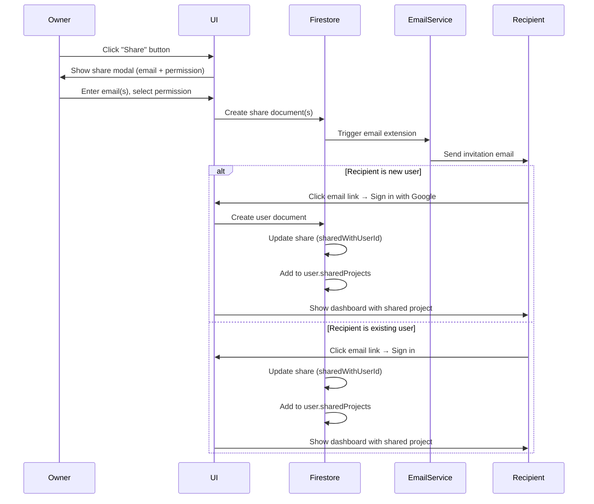
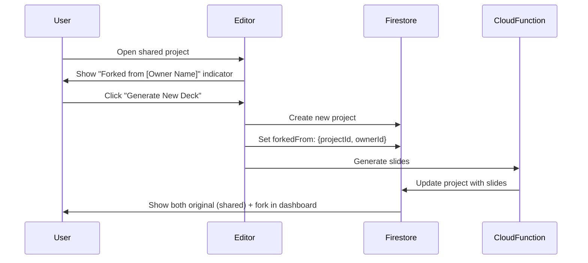
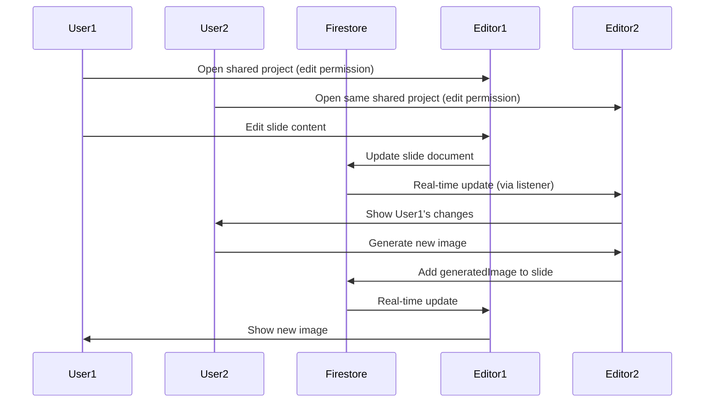

# Project Sharing and Collaboration Feature

## Overview

This feature enables users to share their slide deck projects with others via email, creating a viral user acquisition mechanism. Shared projects support real-time collaboration, automatic forking when new decks are generated, and frictionless onboarding for new users who receive shares.

## Architecture

### Data Model Changes

#### 1. New Collections/Subcollections

**`shares` collection (top-level)**

- Structure: `shares/{shareId}` (Firestore auto-generated document ID)
- Fields:
  - `projectId`: string (reference to project)
  - `ownerId`: string (userId of project owner)
  - `sharedWithEmail`: string (recipient email)
  - `sharedWithUserId`: string | null (userId once recipient signs up)
  - `permission`: 'read' | 'edit'
  - `token`: string (secure token for email invitation links, generated via crypto.randomUUID)
  - `createdAt`: Timestamp
  - `acceptedAt`: Timestamp | null
  - `status`: 'pending' | 'accepted' | 'revoked'

**Update `ProjectData` interface** (`shared/types.ts` and `src/services/projectService.ts`)

- Add `sharedWith`: string[] (array of userIds who have access)
- Add `isShared`: boolean (computed/denormalized for quick filtering)
- Add `forkedFrom`: { projectId: string, ownerId: string } | null (tracks fork relationship)

#### 2. User Document Updates

**`users/{userId}` document**

- Add `pendingShares`: string[] (array of shareIds for shares not yet accepted)
- Add `sharedProjects`: string[] (array of projectIds user has access to - denormalized for fast dashboard queries)

### Sharing Flow



### Forking Flow



### Real-time Collaboration



## Implementation Details

### 1. Database Schema

**File:** `shared/types.ts`

Add new interfaces:

```typescript
export interface Share {
    id?: string; // Firestore auto-generated document ID
    projectId: string;
    ownerId: string;
    sharedWithEmail: string;
    sharedWithUserId: string | null;
    permission: 'read' | 'edit';
    token: string; // Secure token for email invitation links (crypto.randomUUID)
    createdAt: Timestamp;
    acceptedAt: Timestamp | null;
    status: 'pending' | 'accepted' | 'revoked';
}

export interface ForkReference {
    projectId: string;
    ownerId: string;
    ownerName?: string;
}
```

Update `ProjectData`:

```typescript
export interface ProjectData {
    // ... existing fields ...
    sharedWith?: string[]; // userIds with access
    isShared?: boolean; // denormalized for queries
    forkedFrom?: ForkReference | null;
}
```

### 2. Firestore Security Rules

**File:** `firestore.rules`

Add rules for shares collection and update project access:

```javascript
// Shares collection
match /shares/{shareId} {
  allow read: if request.auth != null && 
    (request.auth.uid == resource.data.ownerId || 
     request.auth.uid == resource.data.sharedWithUserId);
  allow create: if request.auth != null && 
    request.auth.uid == resource.data.ownerId;
  allow update: if request.auth != null && 
    (request.auth.uid == resource.data.ownerId || 
     request.auth.uid == resource.data.sharedWithUserId);
  allow delete: if request.auth != null && 
    request.auth.uid == resource.data.ownerId;
}

// Updated project access rules
match /users/{userId}/projects/{projectId} {
  // Allow read if owner OR has share record
  allow read: if request.auth != null && (
    request.auth.uid == userId ||
    exists(/databases/$(database)/documents/shares/$(shareId)) where 
      shareId == projectId + '_' + request.auth.uid
  );
  
  // Allow write if owner OR has edit permission share
  allow update: if request.auth != null && (
    request.auth.uid == userId ||
    (exists(/databases/$(database)/documents/shares/$(shareId)) where 
      shareId == projectId + '_' + request.auth.uid &&
      get(/databases/$(database)/documents/shares/$(shareId)).data.permission == 'edit')
  );
  
  // Only owner can delete
  allow delete: if request.auth != null && request.auth.uid == userId;
  
  // Slides subcollection - same rules as parent
  match /slides/{slideId} {
    allow read, write: if request.auth != null && (
      request.auth.uid == userId ||
      exists(/databases/$(database)/documents/shares/$(shareId)) where 
        shareId == projectId + '_' + request.auth.uid
    );
  }
}
```

**Note:** The share lookup logic above uses Firestore queries. In security rules, we'll need to query the shares collection to check access. The actual implementation will:
1. Query `shares` collection where `projectId == {projectId}` AND `sharedWithUserId == {userId}` AND `status == 'accepted'`
2. Use the share document to check permissions
3. Denormalized `user.sharedProjects` array is for fast dashboard queries only, not for access control

### 3. Storage Rules

**File:** `storage.rules` (needs to be created/updated)

Allow shared users to read images and files from original owner's storage:

```javascript
rules_version = '2';
service firebase.storage {
  match /b/{bucket}/o {
    match /users/{ownerId}/projects/{projectId}/images/{imageId} {
      allow read: if request.auth != null && (
        request.auth.uid == ownerId ||
        // Check if user has share access (via Firestore)
        exists(/databases/$(database)/documents/shares/$(shareId)) where
          shareId == projectId + '_' + request.auth.uid
      );
      allow write: if request.auth != null && request.auth.uid == ownerId;
    }
    
    match /users/{ownerId}/projects/{projectId}/files/{fileId} {
      allow read: if request.auth != null && (
        request.auth.uid == ownerId ||
        exists(/databases/$(database)/documents/shares/$(shareId)) where
          shareId == projectId + '_' + request.auth.uid
      );
      allow write: if request.auth != null && request.auth.uid == ownerId;
    }
  }
}
```

### 4. Share Service

**New File:** `src/services/shareService.ts`

Functions:
- `shareProject(userId, projectId, emails, permission)`: Create share records with secure tokens
- `getProjectShares(projectId)`: Get all shares for a project
- `getUserSharedProjects(userId)`: Get projects shared with user (uses denormalized `user.sharedProjects` array for fast queries)
- `updateSharePermission(shareId, userId, newPermission)`: Update share permission (read ↔ edit) - allows changing permissions after sharing
- `revokeShare(shareId, userId)`: Remove share access immediately - removes from `user.sharedProjects` and sets status to 'revoked'
- `acceptShare(token, userId)`: Accept pending share by token (from email link)
- `acceptShareByShareId(shareId, userId)`: Accept pending share by shareId (internal use)
- `checkPendingShares(userId)`: Check for shares when user signs in, batch accept all pending shares
- `getShareByToken(token)`: Lookup share by token for email link validation
- `handleProjectDeletion(projectId, userId)`: Cascade delete all shares when project is deleted (preserves forks)

### 5. Share UI Components

**New File:** `src/components/ShareModal.tsx`

- **Tag input for emails** (chip-based, like Gmail/Slack/Notion):
  - Each email becomes a chip/tag
  - Validate email format before adding
  - Show error for invalid emails
  - Easy to remove chips (X button on each)
  - Prevents duplicate emails
  - Use library: `react-tag-input-component` or custom implementation
- Permission selector (read-only vs edit)
- List of current shares with:
  - Email/name of recipient
  - Current permission (read/edit)
  - **Edit permission button** (allows changing permission after sharing)
  - Revoke button
- Share link generation (optional)

**Update:** `src/components/Dashboard.tsx`

- Add share button to project cards
- **Add fork button to shared project cards** (allows forking from dashboard)
- Add filter tabs: "All", "Yours", "Shared"
- Show share indicators (badge + owner name) on shared project cards
- Query both owned and shared projects

**Update:** `src/components/Editor.tsx`

- Add share button in header
- **Add fork button in header** (when viewing shared project)
- Show "Forked from [Owner]" indicator if forked
- **Collaborator indicator** (count badge + expandable avatar list):
  - Badge: "3 viewing" in header
  - Hover/click expands to show avatars + names
  - Real-time updates via Firestore presence or active viewers collection
- Handle real-time updates from Firestore listeners

**Update:** `src/components/SlideCard.tsx`

- Show owner indicator on shared project slides
- Disable edit actions if read-only permission

### 6. Email Integration

**Primary: Firebase Extension (Trigger Email or Send Email)**
- Configure to trigger on `shares` collection document creation
- **Batch emails by recipient**: If multiple shares are created for the same email, batch them into a single email
- Email template with:
  - Project title and owner name
  - "View Project" button linking to `/accept-share?token={shareToken}`
  - If multiple shares: List all projects being shared
  - Sign-up prompt if new user

**Fallback: Cloud Function with Resend API**
- If Firebase Extension not available, use Cloud Function
- Use Resend API (modern, developer-friendly, good free tier)
- Function triggers on `shares` collection document creation
- Batch shares by `sharedWithEmail` before sending
- Single email per recipient with list of all pending shares
- **Error Handling:**
  - Share document created immediately (user sees success)
  - Email send happens asynchronously
  - If email fails: Log error, retry with exponential backoff (3-5 retries)
  - Optional: Show subtle notification if email fails after all retries
  - Don't block user - share is created regardless of email status

**Email Link Structure:**
- URL format: `/accept-share?token={secureToken}`
- Token is validated server-side before accepting share
- Token prevents enumeration attacks and unauthorized access

### 7. Onboarding Flow

**Update:** `src/App.tsx`

- On user sign-in:
  1. Check for pending shares by querying `shares` collection where `sharedWithEmail == user.email` and `status == 'pending'`
  2. **Batch accept all pending shares** for that email
  3. For each accepted share:
     - Update share: `sharedWithUserId = user.uid`, `status = 'accepted'`, `acceptedAt = now`
     - Add `projectId` to `user.sharedProjects` array (denormalized)
     - Add `shareId` to project's `sharedWith` array (if needed)
  4. Navigate to dashboard (which shows shared projects)

**Alternative Flow (via email link):**
- User clicks email link: `/accept-share?token={token}`
- If not signed in: Prompt sign-in, then accept share
- If signed in: Accept share immediately
- Redirect to dashboard or project editor

**Update:** `src/components/Dashboard.tsx`

- **Hybrid Query Strategy** (denormalized for performance):
  1. User's own projects: Query `users/{userId}/projects` directly
  2. Shared projects: Use denormalized `user.sharedProjects` array to query projects directly
     - Query: `users/{userId}/projects` where `projectId in sharedProjects`
  3. Shares collection is used for:
     - Access control (Firestore security rules)
     - Permission checking (read vs edit)
     - Share management (revoke, list shares)

- Merge and display with appropriate indicators
- Real-time updates via Firestore listeners on both collections

### 8. Forking Logic

**New Component:** `src/components/ForkButton.tsx`
- Reusable fork button component
- Used in both Editor header and Dashboard cards
- Shows "Fork" or "Fork Project" label
- Handles fork flow

**Update:** `src/components/Editor.tsx` and `src/components/InputForm.tsx`

- When forking from shared project:
  1. Pre-populate input form with original project's metadata:
     - `topic`, `gradeLevel`, `subject`, `additionalInstructions`
  2. Allow user to edit these inputs before generating
  3. User clicks "Generate New Deck" with their (possibly modified) inputs
  4. Create new project under current user
  5. Set `forkedFrom: { projectId, ownerId, ownerName }`
  6. Generate new slides based on user's inputs (don't copy slides from original)

**UX Flow:**
- **From Editor**: User opens shared project, sees "Fork" button in header
- **From Dashboard**: User sees "Fork" button on shared project card
- Clicking fork: Form opens pre-filled with original inputs, user can edit
- User generates new deck → creates fork with new slides
- Fork appears in dashboard with "Forked from [Owner]" indicator

**Update:** `src/components/Dashboard.tsx`

- Show "Forked from [Owner Name]" on forked project cards
- Link back to original if user has access

### 9. Real-time Collaboration

**Update:** `src/components/Editor.tsx`

- Use Firestore `onSnapshot` listeners for shared projects
- **Collaborator Indicator: Count Badge + Expandable Avatar List**
  - Badge in header: "3 viewing" (simple, unobtrusive)
  - Hover or click expands to show:
    - List of avatars with names
    - Real-time updates as users join/leave
  - Track active viewers via Firestore presence or active viewers subcollection
- **Concurrent Edit Strategy: Last Write Wins**
  - Firestore handles conflict resolution automatically
  - Last write to a field wins (simple, predictable)
  - Optimistic UI updates for better UX
  - Can enhance later with field-level locking or operational transforms if needed
  - Most projects won't have heavy concurrent editing, so this is sufficient

### 10. Query Optimization

**New Firestore Indexes** (`firestore.indexes.json`):

```json
{
  "indexes": [
    {
      "collectionGroup": "shares",
      "queryScope": "COLLECTION",
      "fields": [
        { "fieldPath": "sharedWithEmail", "order": "ASCENDING" },
        { "fieldPath": "status", "order": "ASCENDING" }
      ]
    },
    {
      "collectionGroup": "shares",
      "queryScope": "COLLECTION",
      "fields": [
        { "fieldPath": "sharedWithUserId", "order": "ASCENDING" },
        { "fieldPath": "status", "order": "ASCENDING" }
      ]
    },
    {
      "collectionGroup": "shares",
      "queryScope": "COLLECTION",
      "fields": [
        { "fieldPath": "projectId", "order": "ASCENDING" },
        { "fieldPath": "status", "order": "ASCENDING" }
      ]
    },
    {
      "collectionGroup": "shares",
      "queryScope": "COLLECTION",
      "fields": [
        { "fieldPath": "token", "order": "ASCENDING" }
      ]
    }
  ]
}
```

## Files to Create/Modify

### New Files

- `src/services/shareService.ts` - Share management functions
- `src/components/ShareModal.tsx` - Share UI component with tag input
- `src/components/ForkButton.tsx` - Reusable fork button component
- `storage.rules` - Storage access rules for shared projects

### Modified Files

- `shared/types.ts` - Add Share and ForkReference interfaces, update ProjectData
- `src/services/projectService.ts` - Update ProjectData interface, add fork helpers, add `handleProjectDeletion` function
- `firestore.rules` - Add shares collection rules, update project access rules
- `firestore.indexes.json` - Add indexes for shares queries

- `src/components/Dashboard.tsx` - Add share button, fork button, filters, shared project indicators
- `src/components/Editor.tsx` - Add share button, fork button, fork indicator, collaborator indicator, real-time collaboration
- `src/components/SlideCard.tsx` - Handle read-only permissions
- `src/components/InputForm.tsx` - Pre-fill form when forking from shared project
- `src/App.tsx` - Handle pending shares on sign-in, token-based share acceptance route
- `src/firebaseConfig.ts` - May need storage rules reference
- `src/main.tsx` or router config - Add route for `/accept-share?token=...`

## User Experience Flow

1. **Sharing:**

- User clicks "Share" on dashboard or editor
- Modal opens with tag input for emails (chip-based, like Gmail/Slack)
- User enters email(s) - each becomes a chip/tag
- Select permission (read/edit) for all shares
- Share records created with secure tokens
- Email sent asynchronously (user sees success immediately)
- Share appears in "Shared with" list with edit permission button

2. **Receiving Share (New User):**

- Receives email with "View Project" link (`/accept-share?token=abc123`)
- Clicks link → redirected to app
- Prompts Google sign-in
- After sign-in:
  - Token validated server-side
  - Share automatically accepted
  - Project added to `user.sharedProjects` array
  - All other pending shares for that email are also accepted (batch)
- Dashboard shows shared project(s) with "Shared by [Owner]" badge

3. **Receiving Share (Existing User):**

- Receives email with link (`/accept-share?token=abc123`)
- Clicks link → if not signed in, prompts sign-in
- Token validated server-side
- Share automatically accepted
- Project added to `user.sharedProjects` array
- Dashboard shows shared project
- If multiple shares in email: All are accepted and shown

4. **Collaborating:**

- Multiple users can view/edit (based on permission)
- Changes sync in real-time via Firestore listeners
- Users see each other's changes live
- Collaborator indicator shows "X viewing" badge
- Hover/click badge to see avatars and names of active viewers
- Owner can change permissions anytime (read ↔ edit) via share list

5. **Forking:**

- User can fork from two locations:
  - **From Editor**: "Fork" button in header when viewing shared project
  - **From Dashboard**: "Fork" button on shared project card
- Clicking fork: Input form opens pre-filled with original project's inputs (topic, gradeLevel, subject, etc.)
- User can edit inputs before generating
- User clicks "Generate New Deck"
- New project created as fork with `forkedFrom` reference
- New slides generated based on user's (possibly modified) inputs
- Dashboard shows both: original (shared) + fork (owned)
- Fork shows "Forked from [Owner]" indicator

6. **Filtering:**

- Dashboard has tabs: "All", "Yours", "Shared"
- "Shared" tab shows only projects shared with user
- Each shared project card shows:
  - Owner name
  - Permission badge (read/edit)
  - Fork button (allows forking from dashboard)

7. **Project Deletion:**

- If owner deletes a shared project:
  - All shares are automatically revoked
  - Shared users lose access immediately (project disappears from their dashboard)
  - Any forks created by users remain theirs (independent copies)

## Security Considerations

1. **Email Validation:** Verify email format before creating share
2. **Rate Limiting:** No limits on shares per project/user (as per requirements)
3. **Permission Checks:** Always verify permissions server-side (Cloud Functions)
4. **Storage Access:** Ensure storage rules properly restrict access
5. **Token Validation:** 
   - Email links use secure tokens (crypto.randomUUID) stored in share document
   - Tokens validated server-side before accepting shares
   - Prevents enumeration attacks and unauthorized access
6. **Share Revocation:** 
   - When share is revoked, immediately remove from `user.sharedProjects` array
   - Set share status to 'revoked'
   - User loses access immediately (project disappears from dashboard)
   - Any forks created by user remain theirs (independent copies)
7. **Permission Changes:**
   - Owner can change share permissions (read ↔ edit) anytime
   - Update `permission` field in share document
   - Changes take effect immediately
8. **Project Deletion:**
   - When owner deletes shared project, cascade delete all shares
   - Set all related shares to 'revoked' status
   - Remove projectId from all users' `sharedProjects` arrays
   - Forks remain independent (they have their own projectId and are not affected)
9. **Denormalization Safety:** 
   - `user.sharedProjects` array is denormalized for performance
   - Shares collection remains source of truth for access control
   - Always verify access via shares collection in security rules

## Implementation Notes

### Email Service Setup

**Option 1: Firebase Extension (Recommended)**
- Install "Trigger Email" or "Send Email" extension from Firebase Console
- Configure to trigger on `shares` collection document creation
- Set up email templates

**Option 2: Cloud Function with Resend (Fallback)**
- Create Cloud Function triggered by `shares` collection writes
- Install Resend SDK: `npm install resend`
- Set up Resend API key in Firebase environment config
- Implement batching logic to group shares by email
- Implement retry logic with exponential backoff

### Tag Input Component

**Option 1: Use Library**
- Install: `npm install react-tag-input-component`
- Or: `npm install react-tagsinput`

**Option 2: Custom Implementation**
- Build simple chip input with:
  - Email validation on add
  - Chip removal (X button)
  - Duplicate prevention
  - Keyboard support (Enter to add, Backspace to remove)

### Fork Button Component

- Create reusable `ForkButton` component
- Props: `projectId`, `projectOwnerId`, `projectOwnerName`
- Handles:
  - Opening pre-filled input form
  - Creating fork project
  - Navigation to new project

### Collaborator Tracking

**Option 1: Firestore Presence (Recommended)**
- Use Firestore's built-in presence system
- Track active viewers in a subcollection: `projects/{projectId}/activeViewers/{userId}`
- Clean up on disconnect

**Option 2: Simple Active Viewers Collection**
- Create `activeViewers` subcollection under project
- Add/remove viewer on editor mount/unmount
- Use `onSnapshot` to track changes

## Key Design Decisions Summary

### Data Architecture
- **Share IDs**: Firestore auto-generated document IDs (not composite keys)
- **Query Strategy**: Hybrid - denormalized `user.sharedProjects` array for fast queries, shares collection for access control
- **Email Links**: Token-based (`/accept-share?token=...`) for security

### User Experience
- **Share Modal**: Tag input (chip-based) for multiple emails (like Gmail/Slack)
- **Fork Button**: Available in both Editor header and Dashboard cards
- **Collaborator Indicator**: Count badge + expandable avatar list on hover/click
- **Forking**: Pre-fill form with original inputs, allow editing before generation
- **Permission Changes**: Owner can change permissions (read ↔ edit) anytime

### Email & Error Handling
- **Email Service**: Firebase Extension (primary), Resend API via Cloud Function (fallback)
- **Email Batching**: Multiple shares to same email = single batched email
- **Error Handling**: Share created immediately, email retries in background (don't block user)

### Project Deletion
- **Cascade Delete**: When owner deletes project, all shares revoked, users lose access
- **Fork Preservation**: Forks remain independent (not affected by original deletion)

### Real-time Collaboration
- **Conflict Resolution**: Last write wins (simple, sufficient for most use cases)
- **Active Viewers**: Track via Firestore presence or active viewers subcollection

### No Limits
- **Share Limits**: No limits on number of shares per project/user

## Future Enhancements (Out of Scope)

- Share link generation (public/private links without email)
- Commenting system
- Activity feed
- Version history
- Advanced conflict resolution for concurrent edits (operational transforms)
- Share expiration dates
- Share analytics (who viewed, when)
- Bulk permission changes

