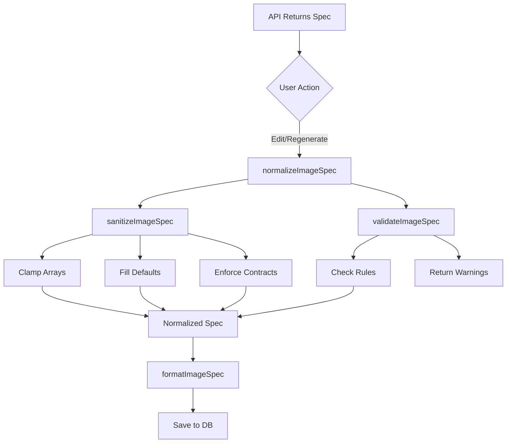
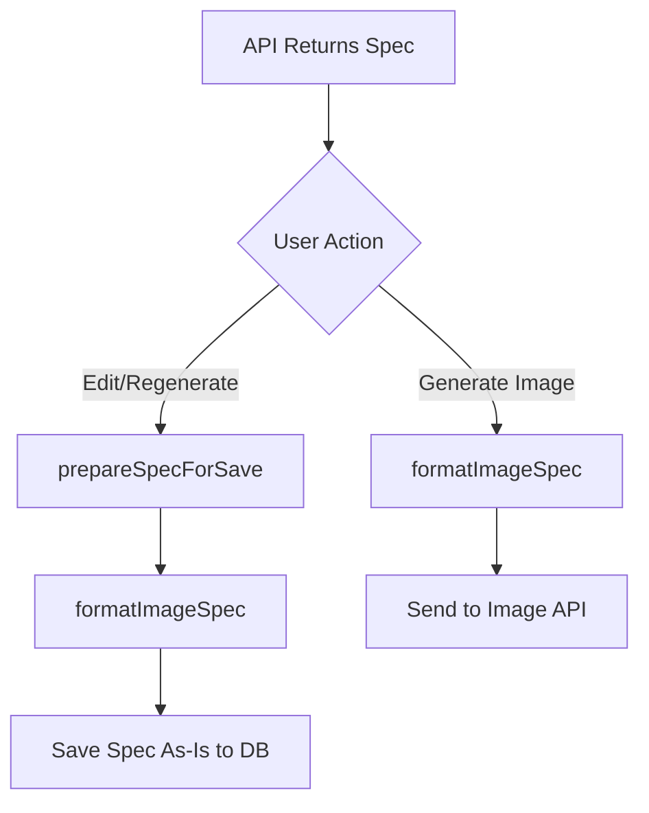

# Remove ImageSpec Validation and Sanitization Logic

## Analysis

### Current State

The codebase currently includes extensive validation and sanitization logic for `ImageSpec` objects that:

1. **Validates** specs against rules (array lengths, required fields, enum values)
2. **Sanitizes** specs by clamping arrays, filling defaults, enforcing contracts
3. **Normalizes** specs by combining validation + sanitization
4. **Applies** this normalization during:

                                                - Spec regeneration (in Cloud Function)
                                                - Spec editing/saving (in frontend `prepareSpecForSave`)

### Problem

This logic is unnecessary because:

- Slide JSON objects are used as-is from the API without validation/sanitization
- Gemini API responses are generally well-formed due to structured output mode
- Edge cases (extra array items, missing optional fields) are not critical
- Adds ~250 lines of complex code that's rarely needed
- Creates confusion about when normalization happens vs doesn't

### Goal

Remove all validation/sanitization logic and treat `ImageSpec` objects like any other API response - use them as-is.

## Files to Modify

### 1. `shared/utils/imageUtils.ts`

**Remove Functions:**

- `validateImageSpec()` (lines 7-95, ~88 lines)
- `sanitizeImageSpec()` (lines 133-238, ~105 lines)
- `normalizeImageSpec()` (lines 245-263, ~18 lines)
- `parseGradeLevel()` (lines 101-127, ~26 lines) - Only used by sanitizeImageSpec

**Keep Functions:**

- All `format*Section()` helper functions (formatHeaderSection, formatVisualElementsSection, etc.)
- `formatImageSpec()` - This formats whatever spec it receives
- `getVisualIdeaSummary()` - This reads spec fields directly

**Total Removed:** ~237 lines

### 2. `src/utils/imageUtils.ts`

**Simplify `prepareSpecForSave()`:**

**Current Implementation:**

```typescript
export function prepareSpecForSave(
    spec: ImageSpec,
    gradeLevel: string,
    subject: string
): { imageSpec: ImageSpec; renderedImagePrompt: string } {
    const { spec: normalizedSpec, warnings } = normalizeImageSpec(spec, gradeLevel);
    
    if (warnings.length > 0) {
        console.warn("Spec validation warnings:", warnings);
    }
    
    const rendered = formatImageSpec(normalizedSpec, { gradeLevel, subject });
    
    return {
        imageSpec: normalizedSpec,
        renderedImagePrompt: rendered
    };
}
```

**New Implementation:**

```typescript
/**
 * Prepares an ImageSpec for saving by formatting it into a prompt.
 * Returns the spec as-is along with the formatted prompt string.
 */
export function prepareSpecForSave(
    spec: ImageSpec,
    gradeLevel: string,
    subject: string
): { imageSpec: ImageSpec; renderedImagePrompt: string } {
    const rendered = formatImageSpec(spec, { gradeLevel, subject });
    
    return {
        imageSpec: spec,  // Return spec exactly as received
        renderedImagePrompt: rendered
    };
}
```

**Update Imports:**

- Remove `normalizeImageSpec` from imports
- Remove `normalizeImageSpec` from exports (line 7)
- Keep `formatImageSpec` and `prepareSpecForSave` exports

### 3. `functions/src/services/specRegeneration.ts`

**Remove Normalization:**

**Current Implementation (lines 50-54):**

```typescript
// Normalize
// Passed gradeLevel could be improved, but for now fixed "3rd Grade" or derived from context if passed
const { spec } = normalizeImageSpec(newSpec, "3rd Grade");

return { spec, inputTokens, outputTokens };
```

**New Implementation:**

```typescript
// Return spec as-is from API (no normalization)
return { 
    spec: newSpec, 
    inputTokens, 
    outputTokens 
};
```

**Update Imports:**

- Remove `normalizeImageSpec` import from line 3

### 4. `src/services/geminiService.ts`

**Update Exports:**

- Remove `normalizeImageSpec` from exports (line 7)
- Keep `prepareSpecForSave` and `getVisualIdeaSummary` exports

### 5. `src/components/SlideCard.tsx`

**No Changes Required:**

- Already uses `prepareSpecForSave()` correctly
- Will automatically use simplified version after update

### 6. `scripts/test-image-utils.ts` (Optional)

**Options:**

1. **Delete the file** (recommended if no longer needed)
2. **Update to only test formatImageSpec and getVisualIdeaSummary**

If updating, remove tests for:

- `validateImageSpec`
- `sanitizeImageSpec`
- `parseGradeLevel`

Keep tests for:

- `formatImageSpec` (with minor updates if needed)

## Implementation Steps

### Step 1: Simplify `prepareSpecForSave()` in `src/utils/imageUtils.ts`

1. Remove `normalizeImageSpec` import
2. Simplify function body to just format and return
3. Update function comment
4. Remove `normalizeImageSpec` from exports

### Step 2: Remove Normalization from `functions/src/services/specRegeneration.ts`

1. Remove `normalizeImageSpec` import
2. Change return statement to use `newSpec` directly instead of normalized version
3. Remove comment about normalization

### Step 3: Remove Functions from `shared/utils/imageUtils.ts`

1. Delete `validateImageSpec()` function (lines 7-95)
2. Delete `parseGradeLevel()` function (lines 101-127)
3. Delete `sanitizeImageSpec()` function (lines 133-238)
4. Delete `normalizeImageSpec()` function (lines 245-263)
5. Update any comments that reference these functions

### Step 4: Update `src/services/geminiService.ts`

1. Remove `normalizeImageSpec` from exports (line 7)

### Step 5: Handle Test Script (Optional)

1. Either delete `scripts/test-image-utils.ts` or update to only test remaining functions

### Step 6: Verify Build

1. Run `npm run build` to ensure no TypeScript errors
2. Verify no broken imports or references

## Code Flow Changes

### Before (Complex)



### After (Simple)



## Expected Outcomes

### Code Reduction

- **~237 lines removed** from `shared/utils/imageUtils.ts`
- **Simplified logic** in `prepareSpecForSave()` and `specRegeneration.ts`
- **Cleaner codebase** with less complexity

### Behavior Changes

- Specs stored exactly as API returns them
- No validation warnings logged
- No array clamping or default filling
- Edge cases (extra items, missing fields) handled naturally by formatter

### What Still Works

- `formatImageSpec()` handles whatever spec it receives (already has defaults in template strings)
- `getVisualIdeaSummary()` reads spec fields directly
- Image generation works with raw specs
- UI display works with raw specs

## Risk Assessment

**Low Risk:**

- `formatImageSpec()` already handles missing/undefined fields with defaults in template strings
- Gemini API generally returns well-formed specs due to structured output
- Worst case: API returns spec with 6 subjects instead of 2-5 → formatter includes all 6 (usually fine)
- Worst case: Missing optional field → formatter uses fallback text (usually fine)

**Testing:**

- Verify image generation still works with typical specs
- Verify formatting works with edge cases (if any occur)
- Verify no TypeScript errors after changes

## Notes

- This change aligns ImageSpec handling with slide JSON handling (both use API responses as-is)
- The `formatImageSpec()` function's internal defaults (like `conceptualPurpose || 'Provide a visual aid...'`) provide sufficient fallback for missing optional fields
- Array length "violations" (like 6 subjects instead of 2-5) are non-critical - the formatter will include all items in the prompt
- Text policy contract enforcement (LIMITED_LABELS requiring labels) is removed - API response is trusted