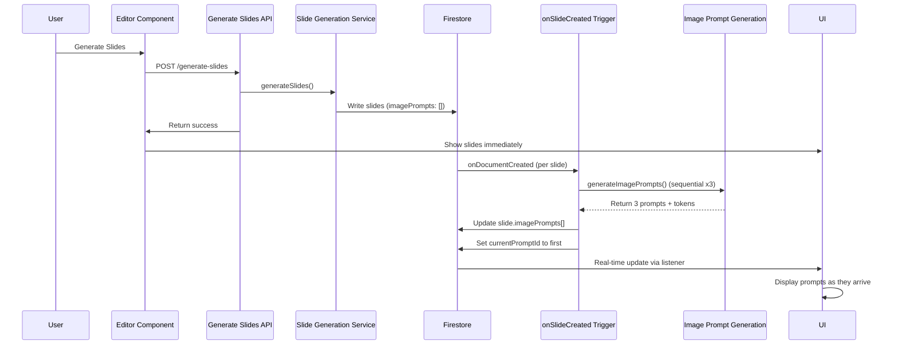

# Separate Image Prompt Generation from Slide Deck Generation

## Overview

This refactor separates image prompt generation from slide content generation. The main slide generation will only create slide content (title, bullets, speaker notes), and a Firestore trigger will automatically generate 3 image prompts per slide using sequential API calls.

## Architecture Flow




## Key Changes Summary

1. **Remove image prompt from slide generation prompt** - Clean up prompt builders
2. **Update schemas** - Remove `imagePrompt` field (no backward compatibility needed)
3. **Refactor image generation service** - Rename `regenerateImagePrompt` to `generateImagePrompts`, generate 3 prompts sequentially (unified function for both trigger and endpoint)
4. **Create Firestore trigger** - `onSlideCreated` triggers prompt generation after slides are written (generates initial 3 prompts)
5. **Update regenerate endpoint** - Use same `generateImagePrompts()` function, append 3 new prompts to existing array (for "New Idea" button)
6. **Update UI** - Add real-time listener on slides subcollection, show loading state when prompts empty

## Implementation Steps

### Phase 1: Remove Image Prompt from Slide Generation

#### 1.1 Update Prompt Builder

**File:** [`shared/promptBuilders.ts`](shared/promptBuilders.ts)

- Remove `buildImagePromptInstructionsSection()` call from `buildSlideGenerationPrompt()` (line 202)
- Update `buildStructureRequirementsSection()` to remove `imagePrompt` references (lines 63-64)
- Update `buildOutputFormatSection()` to remove `imagePrompt` field from JSON schema (line 125)

**Changes:**

- Remove image prompt generation instructions from main prompt
- Structure requirements should only mention: Title, Content, Speaker Notes
- Output format JSON schema excludes `imagePrompt` field

#### 1.2 Update Slide Generation Schema

**File:** [`shared/schemas.ts`](shared/schemas.ts)

- Remove `imagePrompt: { type: "string" }` from `SLIDES_SCHEMA` properties (line 15)
- Field is already not in `required` array, so no change needed there

#### 1.3 Update Validation

**File:** [`shared/utils/validation.ts`](shared/utils/validation.ts)

- Remove `imagePrompt` validation check (line 20)
- Validation should not reference `imagePrompt` at all

#### 1.4 Update Slide Normalization

**File:** [`functions/src/services/slideGeneration.ts`](functions/src/services/slideGeneration.ts)

- Remove `imagePrompt` handling from slide normalization (lines 134-140)
- Initialize slides with empty `imagePrompts: []` array
- Remove `currentPromptId` initialization from slide normalization

**Before:**

```typescript
imagePrompts: (s.imagePrompt && s.imagePrompt.trim()) ? [{...}] : [],
currentPromptId: (s.imagePrompt && s.imagePrompt.trim()) ? promptId : undefined
```

**After:**

```typescript
imagePrompts: [],  // Will be populated by trigger
currentPromptId: undefined  // Will be set by trigger to first prompt
```


### Phase 2: Refactor Image Generation Service

#### 2.1 Rename and Refactor Function

**File:** [`functions/src/services/imageGeneration.ts`](functions/src/services/imageGeneration.ts)

- Rename `regenerateImagePrompt()` to `generateImagePrompts()`
- Modify function signature to accept project metadata
- Implement sequential generation of 3 prompts per slide
- Return array of prompts with aggregated token counts
- Handle errors gracefully (if a prompt fails, continue with others)

**New Function Signature:**

```typescript
export async function generateImagePrompts(
    topic: string,
    subject: string,
    gradeLevel: string,
    slideTitle: string,
    slideContent: string[]
): Promise<{
    prompts: Array<{ id: string; text: string; inputTokens: number; outputTokens: number }>;
    totalInputTokens: number;
    totalOutputTokens: number;
}>
```

**Implementation Details:**

- Loop 3 times, calling existing prompt generation logic sequentially
- Generate UUID for each prompt ID
- Collect successful prompts and token counts
- Continue on individual failures (save what succeeded)
- Return all prompts that succeeded (may be fewer than 3)
- Aggregate total tokens across all successful generations

### Phase 3: Create Firestore Trigger

#### 3.1 Create Trigger Function

**File:** [`functions/src/index.ts`](functions/src/index.ts)

- Add new Cloud Function with `onDocumentCreated` trigger on `users/{userId}/projects/{projectId}/slides/{slideId}`
- Use `firebase-functions/v2/firestore` for v2 functions
- Fetch project metadata (topic, subject, gradeLevel) from project document
- Call `generateImagePrompts()` for the slide
- Update slide document with `imagePrompts` array and set `currentPromptId` to first prompt
- Track token costs using pricing service (single aggregate call)
- Handle errors gracefully (log but don't fail the trigger)

**Implementation:**

```typescript
import { onDocumentCreated } from 'firebase-functions/v2/firestore';
import { generateImagePrompts } from './services/imageGeneration';
import { calculateAndIncrementProjectCost } from './services/pricingService';
import { MODEL_SLIDE_GENERATION } from '@shared/constants';

export const onSlideCreated = onDocumentCreated(
    {
        document: 'users/{userId}/projects/{projectId}/slides/{slideId}',
    },
    async (event) => {
        const slideData = event.data?.data();
        const slideRef = event.data?.ref;
        const projectId = event.params.projectId;
        const userId = event.params.userId;

        // Skip if imagePrompts already exists (defense in depth)
        if (slideData?.imagePrompts && slideData.imagePrompts.length > 0) {
            return;
        }

        // Fetch project to get metadata
        const projectRef = admin.firestore()
            .collection('users').doc(userId)
            .collection('projects').doc(projectId);
        const projectDoc = await projectRef.get();
        
        if (!projectDoc.exists) {
            console.error(`Project ${projectId} not found`);
            return;
        }

        const projectData = projectDoc.data();
        
        try {
            // Generate 3 prompts sequentially
            const result = await generateImagePrompts(
                projectData?.topic || '',
                projectData?.subject || '',
                projectData?.gradeLevel || '',
                slideData?.title || '',
                slideData?.content || []
            );

            if (result.prompts.length > 0) {
                // Update slide with prompts array
                await slideRef?.update({
                    imagePrompts: result.prompts.map(p => ({
                        id: p.id,
                        text: p.text,
                        createdAt: Date.now(),
                        isOriginal: true,  // Mark prompts generated by trigger as original
                        inputTokens: p.inputTokens,
                        outputTokens: p.outputTokens
                    })),
                    currentPromptId: result.prompts[0].id  // Set to first prompt
                });

                // Track costs (aggregate all prompts in single call)
                await calculateAndIncrementProjectCost(
                    projectRef,
                    MODEL_SLIDE_GENERATION,
                    result.totalInputTokens,
                    result.totalOutputTokens,
                    'text'
                );
            }
        } catch (error) {
            // Log error but don't throw (triggers should be idempotent)
            console.error(`Error generating image prompts for slide ${slideRef?.id}:`, error);
        }
    }
);
```


#### 3.2 Update Regenerate Endpoint

**File:** [`functions/src/index.ts`](functions/src/index.ts)

Update the `/regenerate-image-prompt` endpoint (lines 161-224) to:

1. Use `generateImagePrompts()` instead of `regenerateImagePrompt()`
2. Fetch existing slide to get current `imagePrompts` array
3. Append the 3 new prompts to existing array
4. Update slide document with appended prompts
5. Track aggregated token costs
6. Return the 3 new prompts

**Key Changes:**
- Change function call from `regenerateImagePrompt()` to `generateImagePrompts()`
- Fetch existing slide data before generating prompts
- Append new prompts: `const updatedPrompts = [...(slideData.imagePrompts || []), ...result.prompts]`
- Update slide with appended array instead of replacing
- Return format should include all 3 prompts (or adjust frontend to handle array response)

**Implementation:**
```typescript
// In /regenerate-image-prompt endpoint:
const slideData = slideDoc.data();
const existingPrompts = slideData?.imagePrompts || [];

// Generate 3 new prompts
const result = await generateImagePrompts(
    projectData?.topic || "",
    projectData?.subject || "",
    projectData?.gradeLevel || "",
    slideData.title || "",
    slideData.content || []
);

if (result.prompts.length > 0) {
    // Append new prompts to existing array
    const updatedPrompts = [
        ...existingPrompts,
        ...result.prompts.map(p => ({
            id: p.id,
            text: p.text,
            createdAt: Date.now(),
            isOriginal: false,  // User-requested prompts are not original
            inputTokens: p.inputTokens,
            outputTokens: p.outputTokens
        }))
    ];

    // Update slide document
    await slideRef.update({
        imagePrompts: updatedPrompts,
        updatedAt: admin.firestore.FieldValue.serverTimestamp()
    });

    // Track costs
    await calculateAndIncrementProjectCost(
        projectRef,
        MODEL_SLIDE_GENERATION,
        result.totalInputTokens,
        result.totalOutputTokens,
        'text'
    );

    // Return new prompts
    res.json({ prompts: result.prompts, totalInputTokens: result.totalInputTokens, totalOutputTokens: result.totalOutputTokens });
}
```

#### 3.3 Export Trigger

- Add export for `onSlideCreated` trigger in `functions/src/index.ts` alongside existing exports
- Ensure trigger is deployed with other functions

### Phase 4: Update Database Actions

#### 4.1 Update Slide Writing

**File:** [`functions/src/services/slideGeneration.ts`](functions/src/services/slideGeneration.ts)

- Ensure slides are written with `imagePrompts: []` initially
- Remove any `imagePrompt` field from slide data before writing
- No `currentPromptId` should be set during initial write

#### 4.2 Project Status

- Keep project status as `completed` when slides are written (don't wait for prompts)
- No need for `imagePromptsGenerationStatus` field

### Phase 5: Update UI for Real-Time Updates

#### 5.1 Add Real-Time Listener on Slides Subcollection

**File:** [`src/components/Editor.tsx`](src/components/Editor.tsx)

- Add `useEffect` hook to listen to slides subcollection
- Use `onSnapshot` on `users/{userId}/projects/{projectId}/slides`
- Update `slides` state when any slide document changes
- Replace the manual `getProject()` call in the status listener with this real-time listener

**Implementation:**

```typescript
useEffect(() => {
    if (!projectId || !user || !currentProjectId) return;
    
    const slidesRef = collection(db, 'users', user.uid, 'projects', currentProjectId, 'slides');
    const q = query(slidesRef, orderBy('sortOrder', 'asc'));
    const unsubscribe = onSnapshot(q, (snapshot) => {
        const updatedSlides = snapshot.docs
            .map(doc => doc.data() as Slide)
            .sort((a, b) => (a.sortOrder || 0) - (b.sortOrder || 0));
        setSlides(updatedSlides);
    });
    
    return () => unsubscribe();
}, [projectId, user, currentProjectId]);
```

**Key Change:** Remove the `getProject()` call from the status listener (lines 143-153) since the slides listener will handle real-time updates.

#### 5.2 Update SlideCard Loading State and "New Idea" Flow

**File:** [`src/components/SlideCard.tsx`](src/components/SlideCard.tsx)

- Show loading state when `imagePrompts.length === 0` (initial generation)
- Display subtle indicator: "Generating image ideas..." with spinner
- Automatically show prompts as they appear (React re-renders when props change via real-time listener)
- No special error handling needed - if prompts don't appear, array stays empty

**Visual States:**

- **No prompts yet:** Show "Generating image ideas..." with subtle spinner
- **Prompts appearing:** Show prompts in selector/carousel as they arrive
- **All complete:** Show all prompts with normal UI

**Update "Regenerate" / "New Idea" Button Flow:**

- The endpoint now appends prompts server-side and updates Firestore
- Real-time listener will automatically update the slide with new prompts
- Frontend can simplify: call endpoint, show loading state, let listener handle UI update
- Remove manual state update code (lines 208-211 in SlideCard.tsx that manually append to imagePrompts)
- Keep the endpoint call and loading state, but rely on Firestore listener for state updates
- This keeps behavior consistent between initial generation (trigger) and user-requested generation (endpoint)


## Files to Modify

1. [`shared/promptBuilders.ts`](shared/promptBuilders.ts) - Remove image prompt instructions
2. [`shared/schemas.ts`](shared/schemas.ts) - Remove imagePrompt from schema
3. [`shared/utils/validation.ts`](shared/utils/validation.ts) - Remove imagePrompt validation
4. [`functions/src/services/slideGeneration.ts`](functions/src/services/slideGeneration.ts) - Remove imagePrompt handling, initialize empty array
5. [`functions/src/services/imageGeneration.ts`](functions/src/services/imageGeneration.ts) - Refactor to generateImagePrompts (3 sequential)
6. [`functions/src/index.ts`](functions/src/index.ts) - Add Firestore trigger, update regenerate endpoint, export trigger
7. [`src/components/Editor.tsx`](src/components/Editor.tsx) - Add slides subcollection listener, remove manual getProject call
8. [`src/components/SlideCard.tsx`](src/components/SlideCard.tsx) - Add loading state for empty prompts array

## Success Criteria

- Slides generate without image prompts
- Firestore trigger generates 3 prompts per slide automatically
- Prompts appear in UI in real-time without refresh
- Loading states show while prompts generate
- currentPromptId is set to first prompt
- Token costs are tracked correctly (aggregated)

## Notes

- No backward compatibility needed - existing slides can be regenerated if needed
- Sequential generation (3 calls) - can be changed to parallel later if needed
- If some prompts fail, save what succeeded (no special error handling)
- Unified function: `generateImagePrompts()` is used by both trigger (initial 3 prompts) and endpoint (additional prompts via "New Idea" button)
- Endpoint appends new prompts to existing array, trigger sets initial prompts array