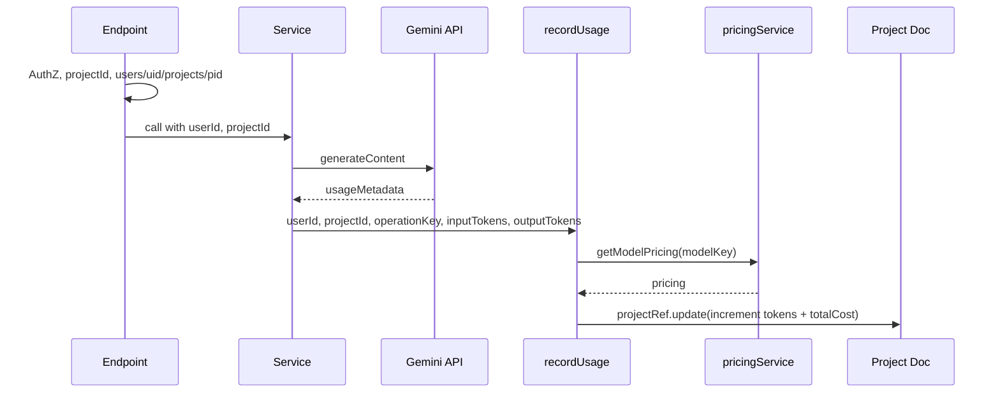

# Simplify Token and Cost Tracking

## 1. Context

**Goal:** Simplify token and cost tracking to “simple hardening” and “move tracking from frontend to backend” without extra overhead. Assumptions: pricing is always set before use; a new project is created per slide-deck run (no retry idempotency); no need for usageEvents, indexes, or a pending-cost backfill.

**Drivers:**

- **Remove pending-cost scheme:** Pricing is always configured; `costStatus: 'pending'`, `processPendingCosts`, and `pendingCostProcessor` are unnecessary.
- **Remove idempotency/retry logic:** New project per creation; no need for `usageEvents/{requestId}` or transaction no-op.
- **Remove indexes:** No queries on usageEvents; drop both composite indexes.
- **Keep:** Server-side token extraction from `usageMetadata`, server-side `operationKey -> modelKey` mapping, and a single path that increments project aggregates (tokens + cost) only.

---

## 2. Spec

### 2.1 Delete Files

- **Delete** [functions/src/services/pendingCostProcessor.ts](functions/src/services/pendingCostProcessor.ts).

### 2.2 [functions/src/index.ts](functions/src/index.ts)

- **Remove:** `import { onSchedule } from 'firebase-functions/v2/scheduler'`, `import { processPendingUsageEvents } from './services/pendingCostProcessor'`, and the `processPendingCosts` export (the `onSchedule('every 5 minutes', ...)` block).
- **Simplify tracking and requestId:**
  - `**/generate-slides`:** Keep `baseRequestId` only for `generationRequestId` on the project. Tracking passed to `generateSlidesAndUpdateFirestore` becomes `{ baseRequestId, userId, projectId }`. Remove `idempotencyKeySource` and `sourceEndpoint`. `requestId` in body can stay as an optional client correlation; if absent, set `baseRequestId = crypto.randomUUID()`.
  - `**/generate-image`:** Stop passing `requestId`, `idempotencyKeySource`, `sourceEndpoint` to `generateImage`. Pass only `{ userId, projectId }`. Remove `requestId` from `req.body` destructuring and all `baseRequestId` / `idempotencyKeySource` logic.
  - `**/extract-text`:** Same as `/generate-image`: pass `{ userId, projectId }` to `extractTextFromImage`; remove `requestId` from body and `baseRequestId` / `idempotencyKeySource`.
  - `**/generate-prompt`:** Keep `baseRequestId` for `promptRequestId` on the slide and for “already generating” logic. Pass `{ userId, projectId }` to `generateImagePromptsForSingleSlide`; remove `idempotencyKeySource` and `sourceEndpoint` from that object.

### 2.3 [functions/src/services/usageEventsService.ts](functions/src/services/usageEventsService.ts)

**Replace** the module with a single `recordUsage` and no `usageEvents`:

- **Remove:** `UsageEventContext`, `TOKEN_BOUNDS`, `validateTokens`, `recordUsageEvent`, all `usageEvents` / `eventRef` / transaction / `eventData` logic, `costStatus`, `pricingId`, `pricingVersion`, `processing`, `parentRequestId`, `sourceEndpoint`, `idempotencyKeySource`, `requestId`.
- **Add `recordUsage**` with signature:
  - `recordUsage(params: { userId: string; projectId: string; operationKey: string; inputTokens: number; outputTokens: number }): Promise<void>`
- **Logic:**
  1. Require `userId`, `projectId`; if missing, throw.
  2. Minimal token check: `Number.isFinite` and `>= 0` for both token counts; if not, throw. (No per-operation bounds.)
  3. `modelKey = getModelForOperation(operationKey)`, `operationType = getOperationType(operationKey)` from [modelMappingService.ts](functions/src/services/modelMappingService.ts).
  4. `pricing = await getModelPricing(modelKey)`; if `!pricing`, throw (pricing is always set).
  5. `cost = calculateCost(inputTokens, outputTokens, pricing)` from [pricingService.ts](functions/src/services/pricingService.ts).
  6. `projectRef = db.collection('users').doc(userId).collection('projects').doc(projectId)`.
  7. Build `updates`: `updatedAt: serverTimestamp()`; if `operationType === 'text'` then `textInputTokens`, `textOutputTokens` else `imageInputTokens`, `imageOutputTokens`; always `totalCost`. All via `FieldValue.increment(...)`.
  8. `await projectRef.update(updates)` (one write, no transaction).
- **Keep:** Imports from `pricingService` and `modelMappingService`.`No`usageEvents` writes.

### 2.4 [functions/src/services/slideGeneration.ts](functions/src/services/slideGeneration.ts)

- **SlideGenerationTracking:** Reduce to `{ baseRequestId: string; userId: string; projectId: string }`. Drop `idempotencyKeySource` and `sourceEndpoint`.
- **Remove:** `safeRecordUsageEvent` and `import { recordUsageEvent, UsageEventContext }`. **Add** `import { recordUsage } from './usageEventsService'`.
- **performUnifiedResearch** and **performSlideGeneration:** Parameter type for `trackingContext`: `{ userId: string; projectId: string }`. Replace `safeRecordUsageEvent({ ...trackingContext, operationKey: '...', inputTokens, outputTokens })` with `recordUsage({ userId: trackingContext.userId, projectId: trackingContext.projectId, operationKey: '...', inputTokens, outputTokens })`.
- **generateSlidesAndUpdateFirestore:**  
  - Accept `tracking: { baseRequestId, userId, projectId }`.  
  - For `performUnifiedResearch` and `performSlideGeneration`, pass `{ userId: tracking.userId, projectId: tracking.projectId }` (no `requestId` / `parentRequestId`).
- **generateImagePromptsForSingleSlide:** Parameter `trackingContext: { userId: string; projectId: string }`. Pass that into `generateImagePrompts`. Replace `safeRecordUsageEvent` with `recordUsage({ userId, projectId, operationKey: 'image-prompt', inputTokens, outputTokens })` in `generateImagePrompts` (see 2.5).

### 2.5 [functions/src/services/imageGeneration.ts](functions/src/services/imageGeneration.ts)

- **Remove:** `safeRecordUsageEvent` and `import { recordUsageEvent, UsageEventContext }`. **Add** `import { recordUsage } from './usageEventsService'`.
- **generateImage(imagePrompt, trackingContext, options):** Type `trackingContext` as `{ userId: string; projectId: string }`. Replace `safeRecordUsageEvent({ ...trackingContext, operationKey: 'image-generation', inputTokens, outputTokens })` with `recordUsage({ userId: trackingContext.userId, projectId: trackingContext.projectId, operationKey: 'image-generation', inputTokens, outputTokens })`.
- **generateImagePrompts(..., trackingContext):** Type `trackingContext` as `{ userId: string; projectId: string }`. Replace `safeRecordUsageEvent` call with `recordUsage({ userId: trackingContext.userId, projectId: trackingContext.projectId, operationKey: 'image-prompt', inputTokens, outputTokens })`.

### 2.6 [functions/src/services/imageTextExtraction.ts](functions/src/services/imageTextExtraction.ts)

- **Remove:** `safeRecordUsageEvent` and `import { recordUsageEvent, UsageEventContext }`. **Add** `import { recordUsage } from './usageEventsService'`.
- **extractTextFromImage(imageBase64, mimeType, trackingContext):** Type `trackingContext` as `{ userId: string; projectId: string }`. Replace `safeRecordUsageEvent` with `recordUsage({ userId: trackingContext.userId, projectId: trackingContext.projectId, operationKey: 'text-extraction', inputTokens, outputTokens })`.

### 2.7 [firestore.indexes.json](firestore.indexes.json)

- **Remove** both `usageEvents` composite indexes. Leave `"indexes": []` (and `"fieldOverrides": []`).

### 2.8 [firestore.rules](firestore.rules)

- **Remove** the entire `match /usageEvents/{eventId} { ... }` block.

### 2.9 No changes

- **[modelMappingService.ts](functions/src/services/modelMappingService.ts):** Keep; still used for `getModelForOperation` and `getOperationType`.
- **[pricingService.ts](functions/src/services/pricingService.ts):** Keep `getModelPricing` and `calculateCost`.
- **Project aggregate fields** ([shared/types.ts](shared/types.ts) `ProjectData`): `textInputTokens`, `textOutputTokens`, `imageInputTokens`, `imageOutputTokens`, `totalCost` stay as-is.
- **Frontend:** No token reporting; no changes if it already does not call `/increment-project-tokens` or send token counts.

---

## 3. Acceptance Criteria

- `pendingCostProcessor.ts` and `processPendingCosts` are gone; no scheduled job for pending costs.
- No writes to `usageEvents`; no `usageEvents` rules or indexes.
- Every Gemini call in Functions still records usage by calling `recordUsage` once per call with `{ userId, projectId, operationKey, inputTokens, outputTokens }`; `recordUsage` performs a single `projectRef.update` with `FieldValue.increment` for the correct token fields and `totalCost`.
- If `getModelPricing` returns null, `recordUsage` throws; no `costStatus: 'pending'` or backfill.
- No `requestId`/`idempotencyKeySource`/`sourceEndpoint` passed for usage; `baseRequestId` remains only where used for `generationRequestId` or `promptRequestId`.
- `recordUsage` uses minimal token validation (finite, non‑negative) and no per-operation bounds.
- `npm run build` (and `tsc`) pass for `functions/`.

---

## 4. Edge Cases

- **Missing pricing:** Treated as hard error; `recordUsage` throws. No fallback or pending path.
- **Transient Firestore errors on `projectRef.update`:** Request fails; no retry in `recordUsage`. Acceptable per “no edge-case focus.”
- **Legacy `usageEvents` data:** Left as-is; no migration. If the collection is unused, it can be cleared manually later.
- `**generateSlides` (deprecated):** Unchanged; can remain throwing if already deprecated.

---

## 5. Tests

- **Unit (optional):** In `recordUsage`, mock `getModelPricing` and `projectRef.update`; assert the correct `increment` fields for `operationType === 'text'` vs `'image'` and that `totalCost` is always included. Assert throws when `userId`/`projectId` missing, tokens invalid, or pricing null.
- **Integration:** After deploy, run one flow each for slide generation, image generation, prompt generation, and text extraction; confirm `textInputTokens`/`textOutputTokens` or `imageInputTokens`/`imageOutputTokens` and `totalCost` increase on the project doc.
- **Build:** `cd functions && npm run build` must succeed.

---

## Flow (after changes)

- One `projectRef.update` per Gemini call; no `usageEvents`, no transaction, no scheduled processor.

