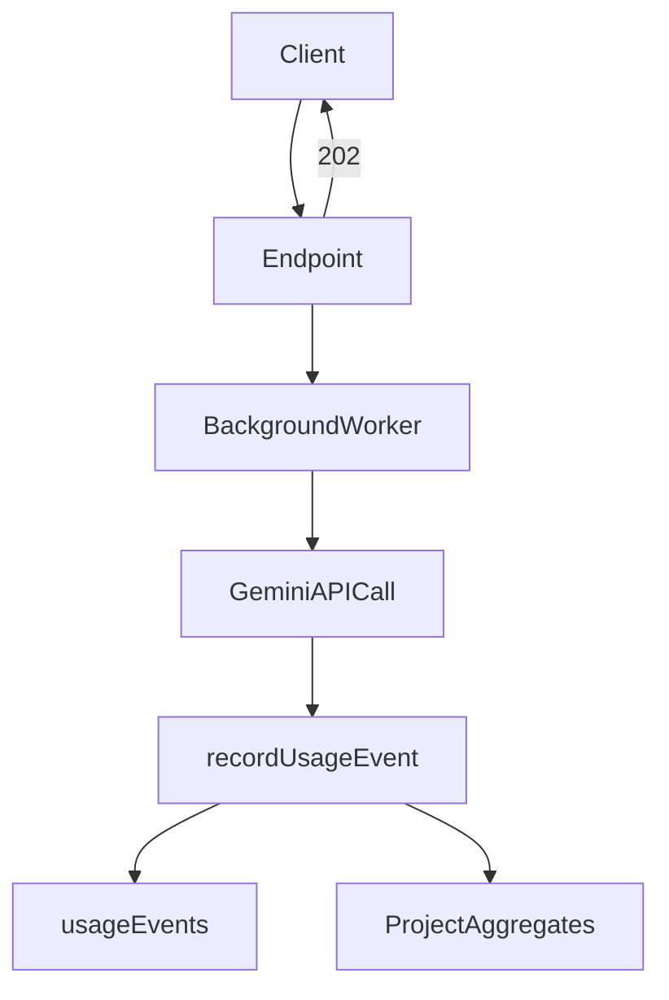

# Update Token/Cost Tracking Plan

## Scope of plan update

- Integrate background execution paths into server-authoritative tracking (no client tracking) while keeping “one tracking call per Gemini operation.”
- Require `projectId` for all Gemini endpoints and update client callers accordingly.
- Align pricing versioning with current `ModelPricing.updatedAt` numeric schema (or explicitly migrate).
- Persist `requestId` for background jobs to preserve idempotency across retries/crashes.
- Decide and document how retries are accounted in token/cost tracking.

## Key gaps to fix (with file anchors)

- Background work bypasses endpoints; tracking must happen where Gemini calls occur.
  - `/generate-slides` background flow uses `generateSlidesAndUpdateFirestore()` in [`functions/src/index.ts`](/Users/sameer/ai-slide-architect/functions/src/index.ts) and Gemini calls live in [`functions/src/services/slideGeneration.ts`](/Users/sameer/ai-slide-architect/functions/src/services/slideGeneration.ts).
  - `/generate-prompt` triggers `generateImagePromptsForSingleSlide()` in the background.
- Client does not send `projectId` for `/generate-image` and `/extract-text` in [`src/services/geminiService.ts`](/Users/sameer/ai-slide-architect/src/services/geminiService.ts).
- Pricing timestamps are numbers in [`shared/types.ts`](/Users/sameer/ai-slide-architect/shared/types.ts) and initialized via `Date.now()` in [`functions/src/utils/initializePricing.ts`](/Users/sameer/ai-slide-architect/functions/src/utils/initializePricing.ts).

## Updated architecture decisions

- **Execution site ownership**: Each Gemini operation has a single owner path that calls `recordUsageEvent()`. If an operation can run in both endpoint and background paths, the background function is the owner and the endpoint must not call `recordUsageEvent()` for that operation. This prevents double tracking.
- **Tracking location**: `recordUsageEvent()` is called immediately after each Gemini API response in the same function that parses `usageMetadata`. This minimizes token handoff errors and keeps tracking close to the source of truth.
- **RequestId persistence**: For background work, store a base `requestId` on the project or slide document when starting generation and reuse it for retries.
- **Pricing version**: Keep `pricingVersion` as a number sourced from `ModelPricing.updatedAt` (number). Optionally add a migration step to Timestamp later, but the plan should not assume Timestamp until the data is migrated.
- **Retry accounting**: Decide whether to record tokens for failed retries (recommended: record only successful calls to avoid partial billing, but document the tradeoff).

## Plan changes to apply

### 1) Revise tracking rule and add background-aware flow

- Replace the “endpoints only” rule with:
  - “Record usage immediately after each Gemini API call where it occurs; ensure only one call per Gemini operation.”
- Add an explicit **single owner per operation** rule:
  - For operations that run in background and endpoint paths, the background function owns `recordUsageEvent()`.
  - Endpoint handlers must not record usage for those operations to avoid duplicates.
- Update plan sections that currently say “service functions do not call `recordUsageEvent()`” to:
  - “Service functions may call `recordUsageEvent()` when they are the execution site (background flows). For endpoint-path calls, tracking can remain in the endpoint.”
- Add a flow note for background generation:
  - `generateSlidesAndUpdateFirestore()` calls `recordUsageEvent()` after `performUnifiedResearch()` and `performSlideGeneration()` results are received.
  - `generateImagePromptsForSingleSlide()` calls `recordUsageEvent()` after `generateImagePrompts()` returns tokens.

### 2) Add requestId persistence for background jobs

- Plan change: When `/generate-slides` starts background work, write `generationRequestId` on `users/{userId}/projects/{projectId}`. Reuse this value inside `generateSlidesAndUpdateFirestore()` to derive `-research` / `-generation` IDs.
  - **Rotation rule**: Set `generationRequestId` when a new generation is started; keep it stable for retries of the same generation; clear or overwrite it only when a new generation is initiated.
- For `/generate-prompt`, write `promptRequestId` on `users/{userId}/projects/{projectId}/slides/{slideId}`.
  - **Rotation rule**: Set `promptRequestId` when prompt generation begins; reuse for retries of the same prompt; clear or overwrite when a new prompt generation (regenerate) is initiated.

### 3) Require `projectId` for all Gemini endpoints and update client calls

- Update plan to include client changes in [`src/services/geminiService.ts`](/Users/sameer/ai-slide-architect/src/services/geminiService.ts):
  - Add `projectId` to `/generate-image` and `/extract-text` request bodies.
  - Update UI call sites to pass the active project ID.
- Keep server AuthZ checks in `functions/src/index.ts` for all endpoints before Gemini calls.

### 4) Align pricing versioning with numeric updatedAt

- Update plan text to compute:
  - `pricingVersion = pricing.updatedAt` (number), not `toMillis()`.
- Optional: add a “migration path” note if converting to Firestore Timestamp later.

### 5) Clarify retry accounting

- Add a small decision section:
  - **Option A (recommended for simplicity)**: Record only successful Gemini calls (ignore failed retries). Clearly document that cost is best-effort and may undercount in failure-heavy scenarios.
  - **Option B**: Record failed attempt tokens too (requires extracting usage metadata on error paths where available).

### 6) Update testing checklist

- Add tests for background tracking and requestId persistence.
- Add tests verifying endpoints reject missing `projectId` for image/text extraction.
- Add tests covering numeric pricingVersion and pending-cost backfill using numeric updatedAt.

## Minimal data flow diagram (updated)

## Files to reference in the updated plan

- [`functions/src/index.ts`](/Users/sameer/ai-slide-architect/functions/src/index.ts)
- [`functions/src/services/slideGeneration.ts`](/Users/sameer/ai-slide-architect/functions/src/services/slideGeneration.ts)
- [`functions/src/services/imageGeneration.ts`](/Users/sameer/ai-slide-architect/functions/src/services/imageGeneration.ts)
- [`functions/src/services/imageTextExtraction.ts`](/Users/sameer/ai-slide-architect/functions/src/services/imageTextExtraction.ts)
- [`src/services/geminiService.ts`](/Users/sameer/ai-slide-architect/src/services/geminiService.ts)
- [`src/components/Editor.tsx`](/Users/sameer/ai-slide-architect/src/components/Editor.tsx)
- [`src/components/SlideCard.tsx`](/Users/sameer/ai-slide-architect/src/components/SlideCard.tsx)
- [`shared/types.ts`](/Users/sameer/ai-slide-architect/shared/types.ts)
- [`functions/src/utils/initializePricing.ts`](/Users/sameer/ai-slide-architect/functions/src/utils/initializePricing.ts)